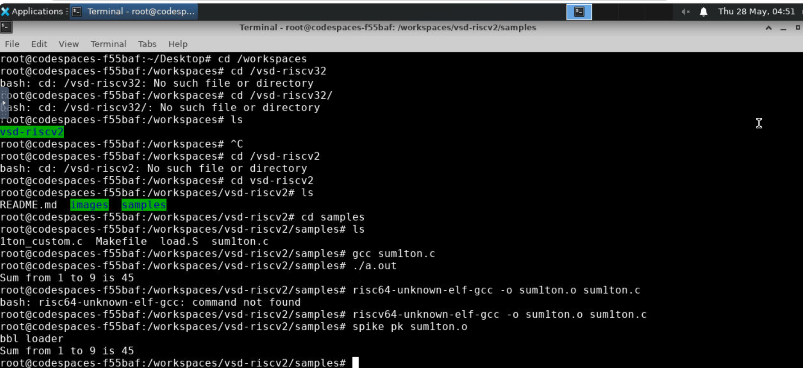

# Day 01 – Understanding How Software Reaches Hardware

## Overview

The first day of the RISC-V based MYTH Program focused on understanding the relationship between software and hardware. Before designing a processor, it is important to understand how a program written in a high-level language is translated into instructions that a processor can execute.

Through theory sessions and hands-on experiments, I explored the RISC-V Instruction Set Architecture (ISA), GNU Toolchain, assembly code generation, and integer number representation.

---

# Learning Journey Map

Throughout Day 01, I explored the following questions:

```text
How does software communicate with hardware?
                ↓
What is the role of an ISA?
                ↓
How does a compiler translate C code?
                ↓
How can we inspect generated assembly?
                ↓
How does a processor represent numbers internally?
                ↓
Understanding the complete software-to-hardware flow
```

---

# How Does Software Communicate with Hardware?

When we write a program in C, the processor cannot directly understand it.

A processor understands only machine instructions represented using binary values.

This led me to investigate the complete execution flow:

```text
C Program
    ↓
Compiler
    ↓
Assembly Code
    ↓
Assembler
    ↓
Machine Code
    ↓
Processor Execution
    ↓
Output
```

The bridge between software and hardware is called the Instruction Set Architecture (ISA).

The workshop introduced RISC-V, an open-source ISA that defines:

* Instructions
* Registers
* Memory operations
* Data formats
* Execution behavior

---

# Why RISC-V?

Some key characteristics of RISC-V are:

* Open-source architecture
* Modular design
* Extensible instruction set
* Industry and academic adoption
* No licensing restrictions

Understanding RISC-V helped me appreciate how software instructions are standardized for processor execution.

---

# How Did I Observe This Flow Practically?

To understand the software development process, I used the GNU Toolchain.

The toolchain provides utilities that convert source code into executable machine instructions.

| Tool      | Purpose                           |
| --------- | --------------------------------- |
| GCC       | Compiles C programs               |
| Assembler | Converts assembly to machine code |
| Objdump   | Displays assembly instructions    |
| Linker    | Generates executable files        |

---

# Hands-on Investigation

## Environment Setup

### Installing Leafpad

```bash
sudo apt install leafpad
```

### Creating a C Program

```bash
leafpad filename.c &
```

---

## Compiling and Executing a Program

The first experiment involved compiling and running a simple C program.

```bash
gcc filename.c
./a.out
```

### Output


---

## Compiling with the RISC-V Compiler

To generate processor-specific instructions:

```bash
riscv64-unknown-elf-gcc -O1 -mabi=lp64 -march=rv64i -o filename.o filename.c
```

Checking the generated object file:

```bash
ls -ltr filename.o
```

This demonstrated how source code is translated into RISC-V compatible instructions.

---

## Assembly Code Analysis

To inspect generated assembly:

```bash
riscv64-unknown-elf-objdump -d filename.o | less
```

This helped me understand how high-level C statements are converted into assembly instructions.

### Assembly Analysis



---

# Lab Experiments

## Experiment 1 – Sum of Numbers from 1 to N

The objective of this experiment was to understand program execution flow and observe how arithmetic operations are translated into processor instructions.

### Program Output


### Key Observations

* Understood loop execution
* Observed arithmetic operations
* Learned instruction generation flow
* Connected software execution with hardware instructions

---

## Experiment 2 – Sum of Numbers from 1 to 1000

This experiment extended the previous example by increasing the iteration count and analyzing the generated instructions.

### Program Output


### Key Observations

* Observed compiler-generated instructions
* Compared program execution behavior
* Understood optimization concepts
* Strengthened assembly analysis skills

---

# Binary Neural Network Program Analysis

As an advanced example, I explored a Binary Neural Network implementation written in C.

The program demonstrated:

* Layer initialization
* Training loops
* Weight updates
* Error calculations

This exercise showed how even complex software applications eventually become processor-executable instructions.

---

# How Does a Processor Understand Numbers?

Processors operate using binary values rather than decimal numbers.

This led me to explore how numbers are represented internally.

---

## Binary Representation

Computers store information using bits.

```text
Bit → 0 or 1
8 Bits → 1 Byte
32 Bits → 1 Word
64 Bits → Double Word
```

---

## Most Significant Bit (MSB) and Least Significant Bit (LSB)

Every binary number contains:

* MSB (Most Significant Bit)
* LSB (Least Significant Bit)

The MSB plays a critical role in determining the sign of a number.

---

## Unsigned Numbers

For an n-bit representation:

```text
Total Values = 2ⁿ
```

For a 64-bit unsigned number:

```text
0 to (2⁶⁴ − 1)
```

---

## Signed Numbers and Two's Complement

Processors use Two's Complement representation to represent negative values.

Rules:

```text
MSB = 0 → Positive Number
MSB = 1 → Negative Number
```

To obtain a negative number:

1. Invert all bits
2. Add 1

---

## Number Range in RV64

Positive Range:

```text
0 to (2⁶³ − 1)
```

Negative Range:

```text
−2⁶³ to −1
```

---

# Key Takeaways

* Understood the software-to-hardware execution flow.
* Learned the role of the RISC-V ISA.
* Explored the GNU Toolchain.
* Generated and analyzed assembly instructions.
* Studied binary and integer representations.
* Built the foundation required for processor design and verification.

---

# My Understanding After Day 01

Before this session, I knew that processors execute programs but did not fully understand the intermediate steps involved.

Day 01 helped me connect:

```text
Software
    ↓
Compiler
    ↓
Assembly
    ↓
Machine Code
    ↓
Processor Execution
```

This understanding forms the foundation for the remaining days of the workshop.

---

[⬅ Back to Repository Home](../README.md)
