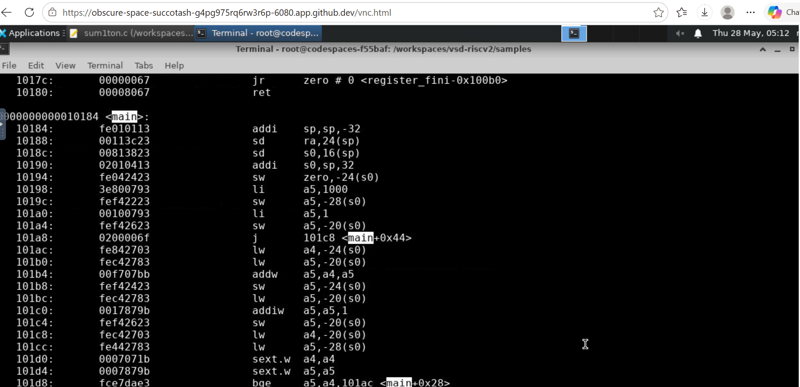
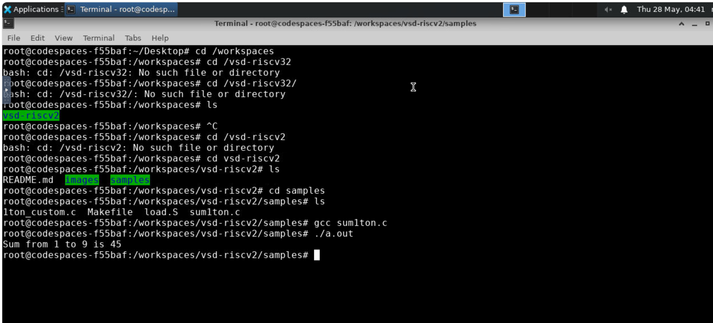
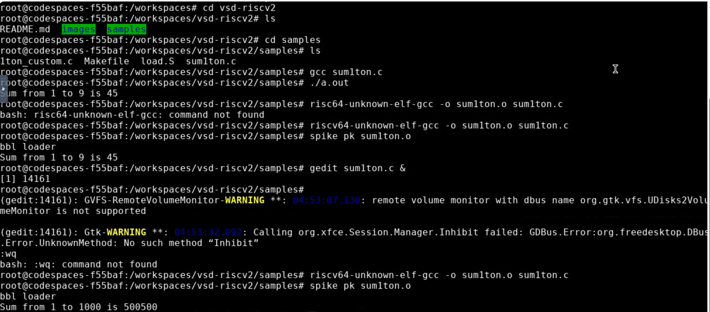

# Day 01 – Understanding How Software Reaches Hardware

## Overview

Day 01 laid the foundation for the entire RISC-V based MYTH Program. Before learning how to design a processor, I first explored how software communicates with hardware and how a program written in a high-level language is eventually executed by a processor.

Through a combination of theory and hands-on experimentation, I investigated the role of the RISC-V Instruction Set Architecture (ISA), the GNU Toolchain, assembly code generation, and integer number representation. This helped me understand the complete journey of a program from source code to processor execution.

---

# Questions Explored Today

During Day 01, I explored the following fundamental questions:

- How does software communicate with hardware?
- What is the role of an Instruction Set Architecture (ISA)?
- Why is RISC-V gaining popularity in modern processor design?
- How does a C program get converted into machine instructions?
- What tools are involved in the software development flow?
- How does a processor represent positive and negative numbers internally?

---

# How Does Software Communicate with Hardware?

When we write a program in C, the processor cannot directly understand the source code. A processor only understands machine instructions represented in binary form.

This raised an important question:

> How does a human-readable C program eventually become executable instructions inside a processor?

To answer this, I explored the software-to-hardware execution flow.

```text
C Program
    ↓
Compiler
    ↓
RISC-V Assembly
    ↓
Assembler
    ↓
Machine Code
    ↓
Processor Execution
    ↓
Output
```

This investigation introduced me to the concept of the **Instruction Set Architecture (ISA)**.

The ISA acts as the interface between software and hardware by defining:

- Supported instructions
- Registers
- Data formats
- Memory access mechanisms
- Execution behavior

The workshop focused on **RISC-V**, an open-standard ISA that enables designers and organizations to build processors without licensing restrictions.

---

# Why is RISC-V Important?

RISC-V has emerged as one of the most influential processor architectures because it is:

- Open-source and royalty-free
- Modular and extensible
- Suitable for both academia and industry
- Widely adopted in modern processor development

Understanding RISC-V helped me appreciate how processor instructions are standardized and executed across hardware implementations.

---

# How Did I Observe This Flow Practically?

After understanding the theory, I explored the software development flow using the GNU Toolchain.

The GNU Toolchain provides utilities that help transform source code into executable machine instructions.

Some of the important tools explored were:

| Tool | Purpose |
|--------|---------|
| GCC | Compiles C programs |
| Assembler | Converts assembly into machine code |
| Objdump | Displays assembly instructions |
| Linker | Combines program components |
| Debug Utilities | Help analyze program execution |

Through these tools, I was able to observe how a simple C program is transformed into instructions that can be executed by a RISC-V processor.

---

# Hands-on Investigation

## Environment Setup

To perform the experiments, I set up an Ubuntu environment and installed the required development tools.

### Installing Leafpad

```bash
sudo apt install leafpad
```

### Creating a C Program

```bash
leafpad filename.c &
```

---

## Compiling and Executing a Program

### Compilation

```bash
gcc filename.c
```

### Execution

```bash
./a.out
```

## Compiling with the RISC-V Compiler

To understand how software is prepared for RISC-V processors, I compiled the program using the RISC-V GCC Toolchain.


```bash
riscv64-unknown-elf-gcc -O1 -mabi=lp64 -march=rv64i -o filename.o filename.c
```

Checking the generated object file:

```bash
ls -ltr filename.o
```

This step demonstrated how source code is converted into processor-specific instructions.

---

## Assembly Code Analysis

To inspect the generated instructions:

```bash
riscv64-unknown-elf-objdump -d filename.o | less
```

This allowed me to analyze the assembly instructions produced by the compiler and understand how high-level statements are translated into machine operations.

### Screenshot


```

---

# Lab Experiments

## Experiment 1 – Sum of Numbers from 1 to N

The first experiment involved creating and analyzing a program that computes the sum of numbers from 1 to N.

### Screenshot


```

### Key Observation

This experiment helped me understand:

- Program execution flow
- Variable handling
- Loop implementation
- Instruction generation

---

## Experiment 2 – Sum of Numbers from 1 to 1000

The second experiment expanded the previous example to calculate the sum of numbers from 1 to 1000.

### Screenshot


```

### Key Observation

By comparing the generated assembly, I observed how the compiler optimizes repetitive operations and converts them into processor instructions.

---

## Experiment 3 – Binary Neural Network Program Analysis

As an advanced example, I explored a Binary Neural Network implementation written in C.

The program included:

- Layer creation
- Training loops
- Weight updates
- Error calculations

Studying this code helped me appreciate how even complex software applications are ultimately translated into processor-executable instructions.

### Screenshot

![Binary Neural Network Analysis]
(images01/riscv_sum1ton.png)


---

# How Does a Processor Understand Numbers?

Humans naturally work with decimal numbers, but processors operate entirely using binary values.

This led me to investigate how numbers are represented internally inside a computer system.

---

## Binary Representation

Computers store information using bits.

A bit can have only two values:

```text
0 or 1
```

Multiple bits combine to form larger numerical values.

For example:

```text
8 Bits  = 1 Byte
32 Bits = 1 Word
64 Bits = Double Word
```

---

## Most Significant Bit (MSB) and Least Significant Bit (LSB)

A binary number contains:

- Least Significant Bit (LSB) → Right-most bit
- Most Significant Bit (MSB) → Left-most bit

The MSB plays an important role in determining whether a signed number is positive or negative.

---

## Unsigned Numbers

For an unsigned number using **n bits**:

```text
Total Values = 2ⁿ
```

For a 64-bit unsigned number:

```text
Range:
0 to (2⁶⁴ − 1)
```

This allows the representation of extremely large positive values.

---

## Signed Numbers

Processors must also represent negative values.

To achieve this, most modern architectures use **Two's Complement Representation**.

### Important Observation

```text
MSB = 0 → Positive Number
MSB = 1 → Negative Number
```

---

## Two's Complement Representation

To represent a negative number:

### Step 1

Invert all bits.

### Step 2

Add 1 to the result.

This technique enables efficient arithmetic operations within processors.

---

## Number Range in RV64

For a 64-bit RISC-V processor:

### Positive Range

```text
0 to (2⁶³ − 1)
```

### Negative Range

```text
−2⁶³ to −1
```

Understanding these ranges is critical because arithmetic instructions operate directly on these binary representations.

---

# Key Observations

During Day 01, I observed that:

- Software and hardware communicate through the ISA.
- A compiler acts as a translator between human-readable code and processor instructions.
- Assembly code provides a direct view of processor operations.
- Binary representation forms the foundation of all processor computations.
- Understanding number representation is essential before studying arithmetic instructions and processor design.

---

# My Understanding After Day 01

Before this session, I knew that processors execute programs, but I did not fully understand the intermediate steps involved.

Day 01 helped me connect the complete chain from:

```text
Software
    ↓
Compiler
    ↓
Assembly
    ↓
Machine Code
    ↓
Hardware Execution
```

I also gained a deeper understanding of how processors represent and manipulate numerical data using binary arithmetic and two's complement representation.

These concepts established the foundation required for understanding ABI, digital design, and processor implementation in the upcoming sessions.

---

# References

- RISC-V based MYTH Program
- RISC-V ISA Documentation
- GNU Toolchain Documentation
- Workshop Notes and Lab Exercises
- Makerchip Learning Resources

---

## Repository Structure

```text
day01/
│
├── README.md
│
└── images01/
    ├── main.png
    ├── riscv_sum1ton.png
    ├── sum1ton.png
    └── sum1to1000.png
```