# Day 02 – Understanding How Software Interacts with Processor Hardware

## Overview

On Day 02, I moved beyond compilation and started exploring how software interacts with processor hardware during execution.

Day 01 helped me understand how a C program becomes machine instructions. In this session, I focused on understanding how those instructions use registers, access memory, follow ABI conventions, and execute inside a RISC-V processor.

I also got my first exposure to debugging and verification using the SPIKE simulator and PicoRV32 processor environment.

---

## What I Explored

The main topics covered during Day 02 were:

* Application Binary Interface (ABI)
* Register Organization in RV64
* Memory Architecture
* Endianness
* Load and Store Operations
* RISC-V Instruction Formats
* SPIKE Debugging
* Firmware Generation
* Processor Verification Flow

---

## Understanding ABI in Practice

One of the biggest takeaways from this session was understanding the role of the ABI.

Before this workshop, function calls felt like a software concept. After exploring ABI conventions, I understood how processors use registers to pass arguments, return values, and maintain execution flow.

A simple way I now view the execution stack is:

```text
Application
    ↓
API
    ↓
ABI
    ↓
ISA
    ↓
Hardware
```

This helped me connect software development concepts with processor architecture.

---

## Registers and Memory

I explored how RV64 processors organize data using registers and memory.

Some observations:

* RV64 contains 32 general-purpose registers.
* ABI aliases such as `a0`, `a1`, `ra`, and `sp` make assembly easier to understand.
* Memory is byte-addressable.
* Multi-byte values are stored using little-endian format.

Understanding how data moves between registers and memory helped me better understand instruction execution.

---

## Lab 1 – Analyzing a Simple C Program

To observe ABI and processor behavior in practice, I started with a simple summation program.

### C Program

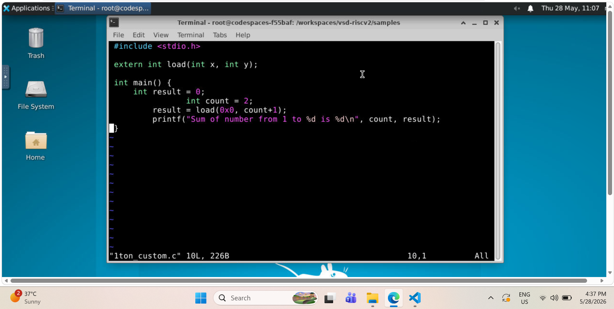

### What I Observed

Although the source code was simple, the processor performs many hidden operations such as passing arguments, storing intermediate values, updating registers, and returning results.

This experiment helped me appreciate how much work occurs behind a simple function call.

---

## Lab 2 – Assembly Language Analysis

I then examined the assembly implementation of the same program.

### Assembly Program

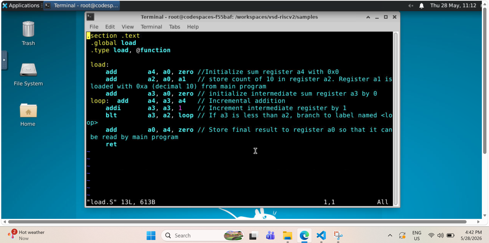

### What I Observed

Reading assembly gave me a much clearer picture of how loops, arithmetic operations, and function calls are actually executed.

This was my first experience connecting:

```text
C Code
    ↓
Assembly
    ↓
Processor Instructions
```

instead of viewing assembly as a separate topic.

---

## Lab 3 – Debugging with SPIKE

One of the most interesting parts of Day 02 was using SPIKE in debug mode.

### Debug Session

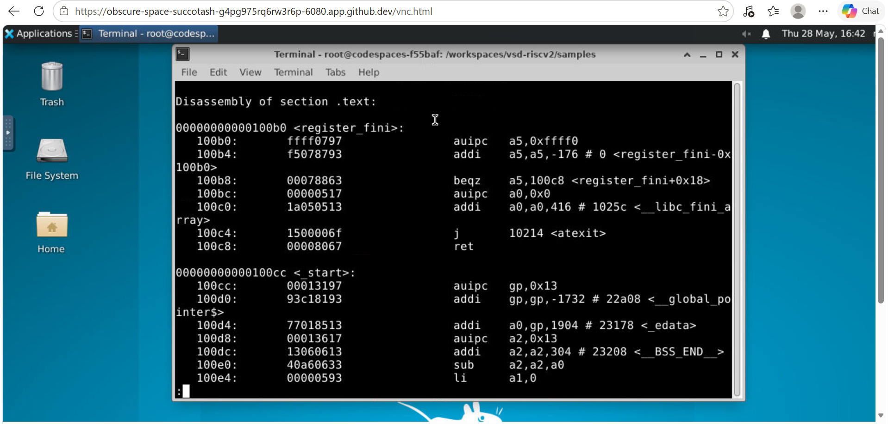

### What I Observed

Using SPIKE allowed me to inspect:

* Register values
* Program counter updates
* Memory contents
* Instruction execution

Stepping through the program instruction by instruction helped me understand how processors actually execute software internally.

For the first time, processor execution became something I could observe instead of just imagine.

---

## Lab 4 – Exploring PicoRV32

The next step was understanding how software executes on an actual processor implementation.

### PicoRV32 Core

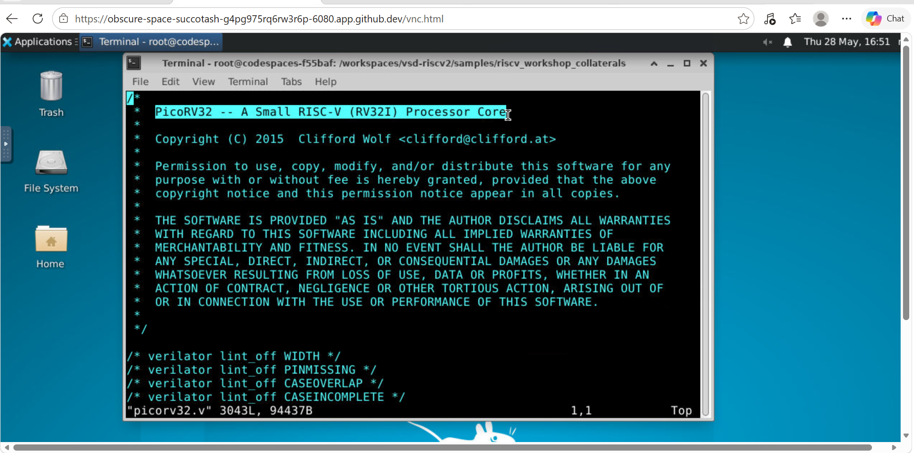

### What I Observed

Studying PicoRV32 helped me connect software execution with hardware blocks such as:

* Program Counter
* Register File
* ALU
* Instruction Decoder
* Memory Interface

This was my first exposure to how a processor is structured internally.

---

## Lab 5 – Firmware Generation and Verification Flow

I also explored the complete software-to-hardware execution flow.

### Repository Setup

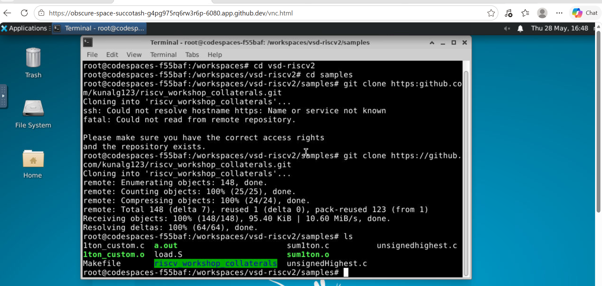

### Hex Generation

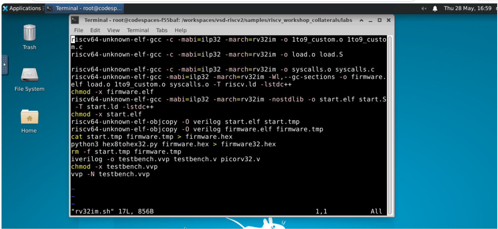

### Firmware Instructions

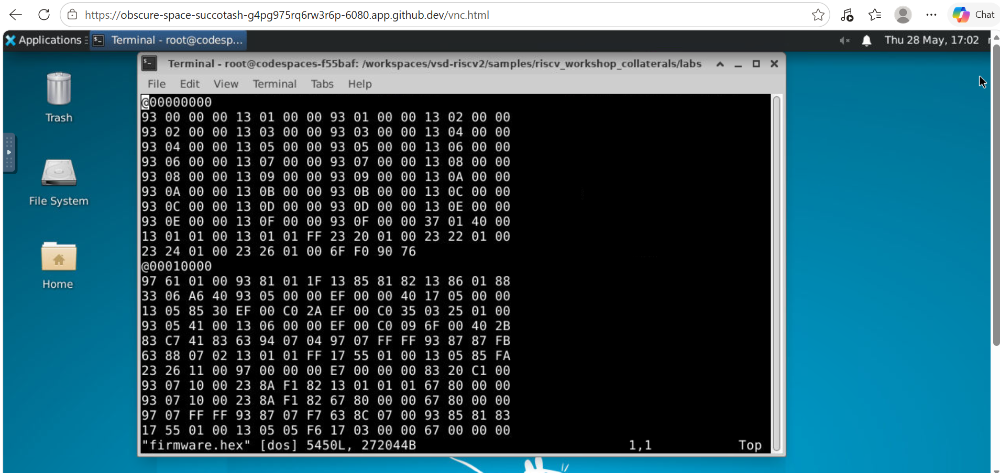

### Instruction Bitstream

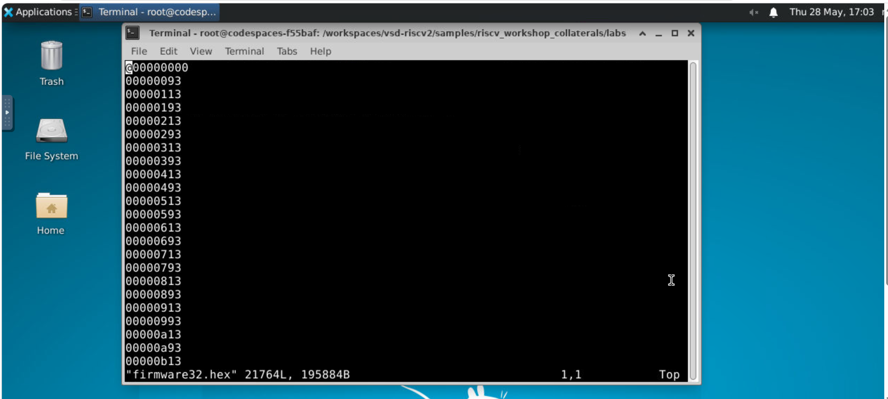

### Memory Initialization

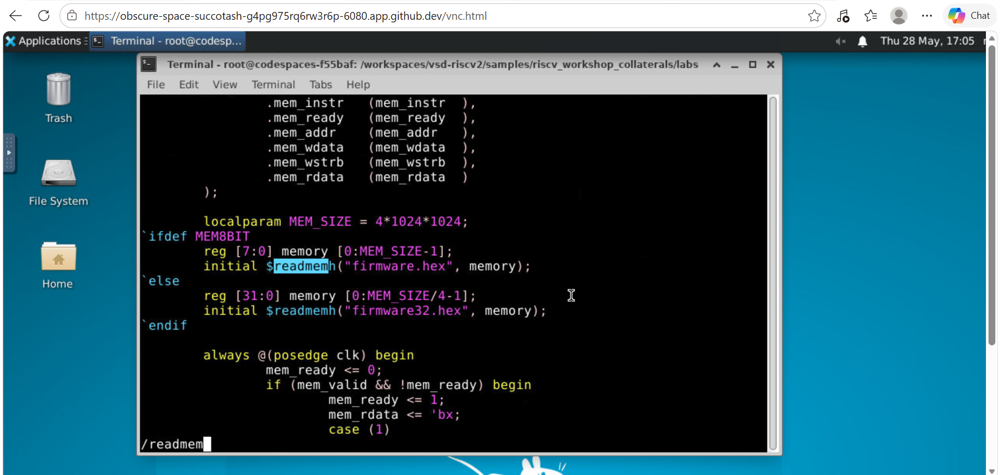

### Testbench Analysis

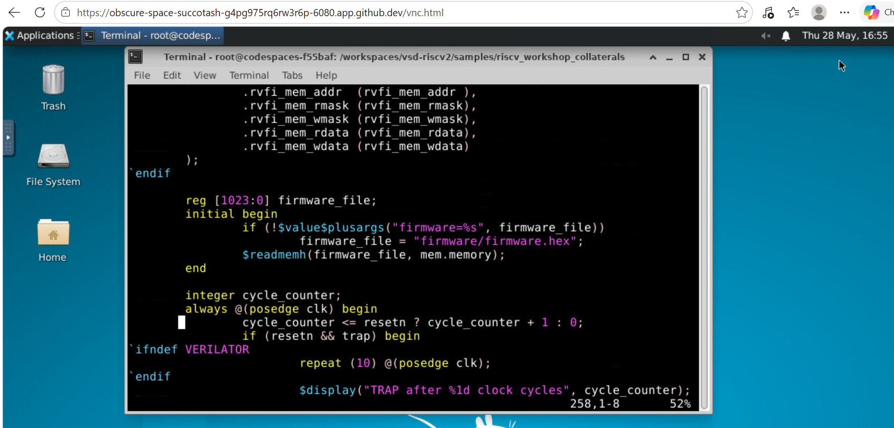

### Final Program Execution

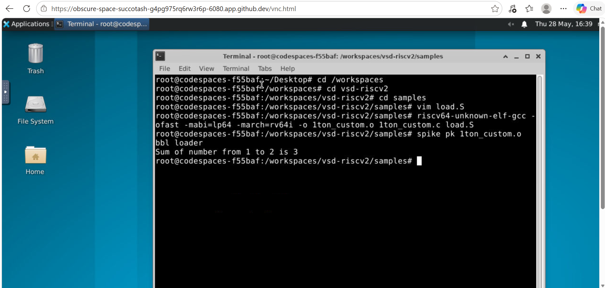

### What I Observed

This was one of the most valuable parts of Day 02.

I learned that processor execution involves much more than simply running a program.

The complete flow looks like:

```text
C Program
    ↓
Compilation
    ↓
Firmware Generation
    ↓
Memory Initialization
    ↓
Processor Execution
    ↓
Verification
```

This helped me understand how software eventually becomes data that can be executed by hardware.

---

## Key Takeaways

By the end of Day 02, I was able to:

* Understand the purpose of the ABI.
* Explore register organization in RV64.
* Understand memory organization and endianness.
* Analyze assembly programs.
* Debug programs using SPIKE.
* Explore PicoRV32 processor architecture.
* Understand firmware generation workflows.
* Learn how memory is initialized before execution.
* Understand the role of testbenches in verification.

---

## My Reflection

Day 01 taught me how software becomes machine instructions.

Day 02 taught me what happens after those instructions are generated.

The biggest takeaway from this session was understanding that successful program execution depends on much more than instructions alone. Registers, memory, firmware, processor hardware, and verification infrastructure all work together to make execution possible.

This session provided the foundation required for the next stage of the workshop, where the focus shifts from software execution to digital logic design and processor implementation.

---

[⬅ Back to Repository Home](../README.md)
