# Day 03 – Digital Logic Design with TL-Verilog and Makerchip

> Day 03 marked a major shift in my learning journey. Until this point, I had focused on how software is translated into instructions and how processors execute them. In this session, I began exploring the actual hardware structures that make computation possible. Through digital logic design, TL-Verilog, and Makerchip, I investigated how complex hardware systems are built from simple logical building blocks.

---

# Overview

Modern processors contain billions of transistors and execute billions of operations every second.

At first glance, this complexity can appear overwhelming.

However, every processor ultimately relies on a surprisingly small set of fundamental digital building blocks.

The objective of Day 03 was to understand these building blocks and learn how they can be combined to create increasingly sophisticated hardware systems.

Throughout this session, I explored:

- Digital Logic Fundamentals
- Logic Gates
- Combinational Logic
- Sequential Logic
- Pipeline Logic
- Hierarchical Design
- TL-Verilog Design Methodology
- Makerchip Development Environment

This day served as the foundation for understanding how hardware is constructed before moving on to processor implementation in the later workshop sessions.

---

# Learning Objectives

By the end of Day 03, I wanted to answer the following questions:

### Hardware Fundamentals

- How do processors perform logical operations?
- What are the fundamental building blocks of digital circuits?
- How are complex systems constructed from simple logic?

### Sequential Behavior

- How does hardware remember information?
- Why are clocks important?
- How does data move across multiple cycles?

### Pipeline Design

- Why do modern processors use pipelines?
- How does pipelining improve performance?
- What role does timing play in hardware design?

### TL-Verilog Methodology

- What advantages does TL-Verilog provide?
- How does timing abstraction simplify hardware development?

---

# Learning Journey Map

The concepts explored during Day 03 can be summarized using the following progression:

```text
Logic Gates
      ↓
Combinational Logic
      ↓
Sequential Logic
      ↓
Pipeline Logic
      ↓
Hierarchical Design
      ↓
TL-Verilog
      ↓
Hardware System Design
```

Each topic builds upon the previous one.

By the end of the session, I was able to see how modern digital systems are assembled from fundamental logic structures.

---

# Investigating the Foundations of Digital Logic

Before studying processor design, it is important to understand how digital systems represent and manipulate information.

Unlike analog systems, digital circuits operate using discrete values:

```text
0 → Logic Low

1 → Logic High
```

Every operation performed by a processor eventually reduces to combinations of these binary states.

This means that:

- Arithmetic Operations
- Comparisons
- Memory Accesses
- Instruction Execution

are all ultimately implemented using digital logic circuits.

---

# Understanding Logic Gates

Logic gates are the fundamental building blocks of digital hardware.

Just as software is built from functions and algorithms, hardware is built from combinations of logic gates.

Every modern processor, memory controller, graphics processor, and accelerator ultimately relies on these elementary components.

---

## Core Logic Gates

The most commonly used logic gates include:

- AND Gate
- OR Gate
- NOT Gate
- NAND Gate
- NOR Gate
- XOR Gate

Each gate performs a specific logical operation on its inputs and produces a deterministic output.

---

## Practical Evidence

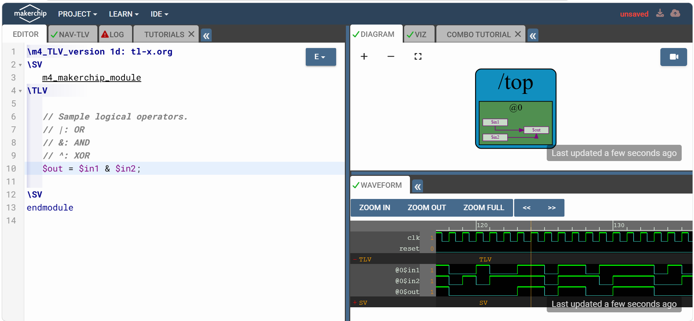

---

## Analysis

The AND gate produces a logic high output only when all inputs are high.

Although this behavior appears simple, it forms the basis of decision-making circuitry inside digital systems.

Many processor control mechanisms rely on AND operations when combining multiple conditions before triggering an action.

---

## Engineering Observation

One of the most important realizations from this section was that sophisticated hardware systems are ultimately built from extremely simple logical operations.

Processor complexity emerges from the combination of many simple structures rather than from individual complex components.

---

# Buffer and Inverter Circuits

While studying logic design, I also explored two of the most frequently used digital components:

### Buffer

A buffer reproduces its input at the output.

```text
Input → Output
```

Although it performs no logical transformation, it is extremely useful for:

- Signal Strengthening
- Fan-out Management
- Timing Optimization

---

## Practical Evidence

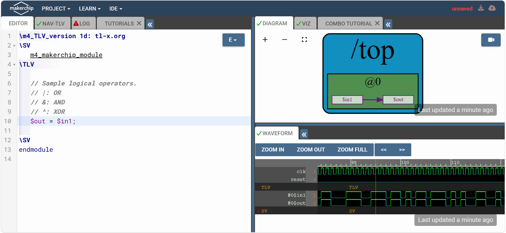

---

### Inverter

An inverter performs logical negation.

```text
0 → 1

1 → 0
```

This simple operation is essential in virtually every digital design.

---

## Practical Evidence


---

## Engineering Observation

Buffers and inverters may appear trivial when viewed individually.

However, they are among the most heavily utilized elements in large-scale hardware designs because of their critical role in signal integrity and timing control.

---

# Investigating Combinational Logic

Once individual gates are understood, they can be combined to perform useful computations.

Circuits whose outputs depend solely on present input values are known as combinational circuits.

These circuits contain:

- No memory
- No state
- No clock dependency

The output is determined entirely by the current inputs.

---

## Why Is Combinational Logic Important?

Many hardware operations rely on combinational logic:

- Arithmetic Units
- Multiplexers
- Encoders
- Decoders
- Comparators

These circuits continuously evaluate inputs and immediately generate outputs.

---

## Example: Full Adder Concept

One of the most important examples of combinational logic is the full adder.

A full adder accepts:

```text
A
B
Carry-In
```

and generates:

```text
Sum
Carry-Out
```

This structure forms the foundation of arithmetic hardware used inside processors.

---

# Understanding Hierarchical Design

As hardware systems become larger, managing complexity becomes increasingly difficult.

To address this challenge, engineers use hierarchical design techniques.

Instead of designing an entire system at once, smaller modules are created and then reused as building blocks.

This approach is similar to software engineering practices where functions and classes are reused to construct larger applications.

---

## Practical Evidence

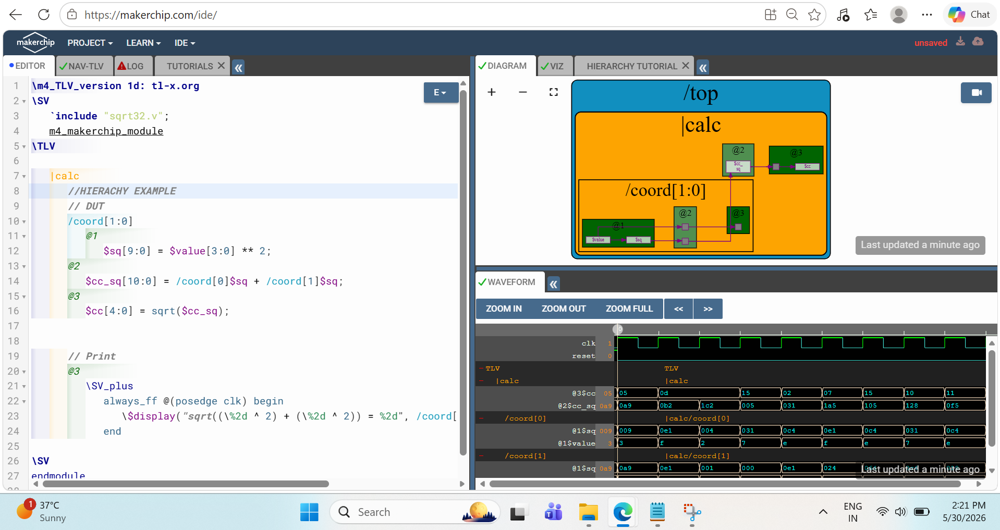

---

## Analysis

The hierarchical approach improves:

- Reusability
- Scalability
- Maintainability
- Debugging Efficiency

By breaking a design into smaller modules, engineers can verify individual components independently before integrating them into larger systems.

---

# Introducing TL-Verilog

Traditional RTL development often requires designers to manually manage timing and pipeline behavior.

This can become challenging as hardware complexity increases.

TL-Verilog was created to simplify this process.

The language introduces timing abstraction, allowing designers to focus more on functionality and less on low-level timing details.

---

## Why TL-Verilog?

TL-Verilog provides:

- Pipeline Abstraction
- Timing Abstraction
- Reduced RTL Complexity
- Improved Design Productivity

These capabilities make it particularly useful for educational environments and rapid hardware development.

---

# My Understanding After Part 1

Before Day 03, I primarily viewed processors from a software perspective.

Through this investigation, I began understanding the physical and logical structures responsible for executing computations.

The key insight gained from this section can be summarized as:

```text
Logic Gates
      ↓
Combinational Logic
      ↓
Reusable Hardware Blocks
      ↓
Complex Digital Systems
```

This understanding established the foundation required for exploring Makerchip, TL-Verilog labs, sequential logic, and pipeline-based hardware design in the next sections.
# Exploring the Makerchip Platform

After understanding the foundations of digital logic, the next step was learning how to design and simulate hardware systems.

For this purpose, the workshop introduced **Makerchip**, a cloud-based Integrated Development Environment (IDE) specifically designed for **TL-Verilog development**.

Unlike traditional hardware design flows that require installing multiple tools, Makerchip provides a complete environment where designs can be written, simulated, visualized, and debugged directly from the browser.

This allowed me to focus on learning hardware concepts without worrying about tool installation or configuration.

---

# Why Makerchip?

Modern hardware design involves much more than simply writing code.

A designer must:

- Create hardware descriptions
- Simulate functionality
- Verify correctness
- Analyze waveforms
- Debug timing behavior

Makerchip integrates all of these capabilities into a single platform.

This makes it an excellent environment for learning digital design concepts.

---

## Key Features of Makerchip

Some of the most useful features I explored were:

### Code Editor

Allows TL-Verilog code to be written directly inside the browser.

### Live Simulation

Automatically compiles and executes the design in the cloud.

### Waveform Viewer

Provides visibility into internal signals and circuit behavior over time.

### Circuit Visualization

Generates graphical representations of hardware structures.

### Debugging Tools

Makes it easier to identify syntax and logic errors.

### Shareable Projects

Projects can be saved and shared using a unique URL.

---

## Engineering Observation

One important realization during this section was that hardware development is highly visualization-driven.

Unlike software development where outputs are often displayed as text, hardware designers frequently rely on waveforms and signal traces to understand system behavior.

The waveform viewer quickly became one of the most valuable tools throughout the workshop.

---

# Understanding the Multiplexer

While exploring combinational logic, I encountered one of the most frequently used circuits in digital design:

> The Multiplexer (MUX)

A multiplexer acts as a digital selector.

It chooses one input from several available inputs and forwards the selected value to the output.

---

## Why Are Multiplexers Important?

Processors constantly need to choose between multiple sources of data.

Examples include:

- Selecting ALU operands
- Choosing memory addresses
- Routing pipeline data
- Selecting control signals

Multiplexers make these decisions possible.

Because of this, they appear in nearly every digital system.

---

# Investigating a 2-to-1 Multiplexer

The simplest multiplexer is the **2-to-1 MUX**.

Inputs:

```text
x1
x2
```

Control Signal:

```text
s
```

Output:

```text
f
```

Operation:

```text
If s = 1 → Output = x1

If s = 0 → Output = x2
```

---

## TL-Verilog Implementation

One elegant way to describe a multiplexer is using the ternary operator.

```verilog
assign f = s ? x1 : x2;
```

This statement directly captures the behavior of a 2-to-1 MUX.

---

## Engineering Observation

What initially appears to be a simple selection operation is actually one of the most fundamental concepts in processor design.

Many advanced processor functions ultimately reduce to choosing between multiple data paths, making multiplexers critical building blocks in modern CPUs.

---

# Combinational Logic Lab 1 – Vector Arrays

After understanding basic combinational structures, I explored vector arrays in TL-Verilog.

Vector arrays allow multiple bits of information to be grouped together and manipulated efficiently.

Rather than working with individual signals, vectors make hardware descriptions more compact and scalable.

This becomes increasingly important when designing larger systems containing buses, registers, and memory structures.

---

## Practical Evidence

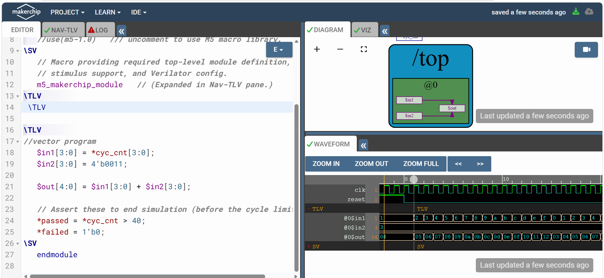

---

## Analysis

The simulation output demonstrates how multiple bits can be treated as a single logical entity.

Instead of processing each bit independently, vector operations allow hardware designers to manipulate entire groups of data simultaneously.

This abstraction simplifies design while improving readability.

---

## Key Learning

Vector arrays provide the foundation for representing larger hardware structures and are heavily used in processor datapaths.

---

# Combinational Logic Lab 2 – Multiplexer Design

Having understood the theory behind multiplexers, I implemented and simulated a multiplexer using TL-Verilog.

The goal was to observe how changing the select signal influences the output.

---

## Problem Statement

Given multiple input signals:

```text
A
B
```

and a select signal:

```text
SEL
```

the circuit should route the selected input to the output.

---

## Practical Evidence

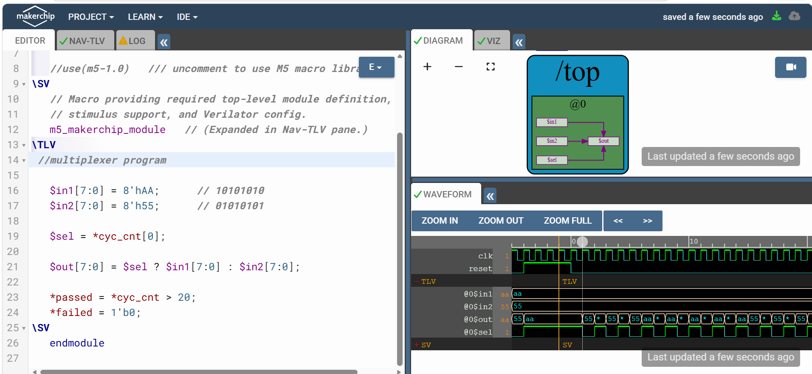

---

## Analysis

The waveform confirms that the output changes according to the state of the select signal.

When the select line changes, the output immediately follows the chosen input.

This demonstrates the purely combinational nature of the circuit.

There is:

- No memory
- No clock dependency
- No state retention

The output depends entirely on the current input conditions.

---

## Engineering Observation

This lab demonstrated how routing decisions are implemented in hardware.

Although the circuit is small, the same principle is used extensively in processor datapaths, control units, and communication interfaces.

---

# Combinational Logic Lab 3 – Calculator Design

To further explore combinational logic, I implemented a simple calculator.

Unlike the multiplexer, which performs routing operations, the calculator performs arithmetic computations.

This introduced the concept of building functional hardware blocks capable of processing numerical data.

---

## Objective

Design a combinational circuit capable of performing arithmetic operations on incoming inputs.

The purpose of the experiment was to observe how mathematical operations can be implemented directly in hardware.

---

## Practical Evidence

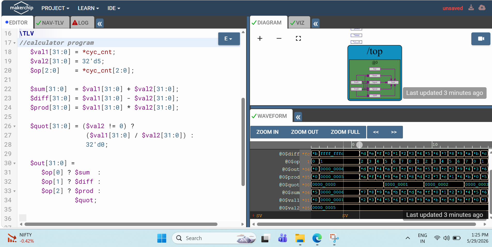

---

## Analysis

The simulation output confirms that arithmetic operations are executed correctly.

The calculator processes input values and produces corresponding outputs based on the implemented logic.

This demonstrates how hardware circuits can be designed to perform useful computational tasks rather than simple signal routing.

---

## Key Learning

This experiment highlighted the difference between:

### Routing Logic

Selecting and forwarding information.

Examples:

- Multiplexers
- Decoders

### Computational Logic

Performing mathematical operations on data.

Examples:

- Adders
- Calculators
- Arithmetic Units

This distinction is fundamental when designing processor datapaths.

---

# Part 2 Reflection

Part 2 transformed my understanding of digital logic from theory into implementation.

Through Makerchip and TL-Verilog, I was able to move beyond conceptual discussions and begin building actual hardware structures.

The progression of concepts explored in this section can be summarized as:

```text
Makerchip Environment
          ↓
Combinational Logic
          ↓
Vector Arrays
          ↓
Multiplexer Design
          ↓
Calculator Design
          ↓
Hardware Construction
```

These experiments provided my first practical experience designing and simulating hardware systems using TL-Verilog.
# Investigating Sequential Logic

Until this point, every circuit I studied belonged to the category of **combinational logic**.

These circuits produced outputs based entirely on their current inputs.

While useful, this creates an important limitation:

> The circuit has no memory.

As soon as the input changes, the output changes.

There is no way to remember previous values.

However, processors must continuously store and update information.

Examples include:

- Program Counters
- Registers
- Memory Addresses
- Pipeline States
- Intermediate Computation Results

To support these functions, hardware requires a mechanism for storing information across multiple clock cycles.

This leads to the concept of **Sequential Logic**.

---

# Why Sequential Logic Matters

The key difference between combinational and sequential circuits is:

### Combinational Logic

```text
Output = Function(Current Inputs)
```

---

### Sequential Logic

```text
Output = Function(Current Inputs + Previous State)
```

The presence of state allows hardware to remember information over time.

This capability makes modern processors possible.

---

# Understanding the Role of the Clock

One of the most important concepts introduced in sequential design is the **clock signal**.

The clock acts as a timing reference for the entire circuit.

Instead of continuously updating outputs, sequential circuits update their state only at specific clock events.

This creates predictable and synchronized behavior across the system.

---

## Why Is a Clock Necessary?

Imagine a processor containing:

- Registers
- ALUs
- Memory Blocks
- Control Units

Without synchronization, data could change unpredictably.

The clock ensures that all components operate in a coordinated manner.

This allows information to move safely through the system.

---

## Engineering Observation

One important realization during this section was that the clock does not perform computations.

Instead, it controls **when computations become permanent**.

This distinction is critical when studying processor architecture.

---

# Investigating State Retention

The defining characteristic of sequential circuits is their ability to retain information.

Once a value is stored, it remains available in future cycles until updated.

This enables circuits to:

- Count events
- Track progress
- Store intermediate values
- Maintain system state

Without state retention, processors would effectively forget everything every cycle.

---

# Sequential Logic Lab 1 – Counter Design

One of the simplest examples of sequential behavior is a counter.

A counter stores a value and updates it every clock cycle.

Unlike combinational circuits, the output depends on previous values.

---

## Objective

Design a circuit capable of:

```text
Store Current Count
      ↓
Increment Count
      ↓
Update on Clock Edge
      ↓
Repeat
```

This demonstrates how hardware can maintain state across time.

---

## Practical Evidence

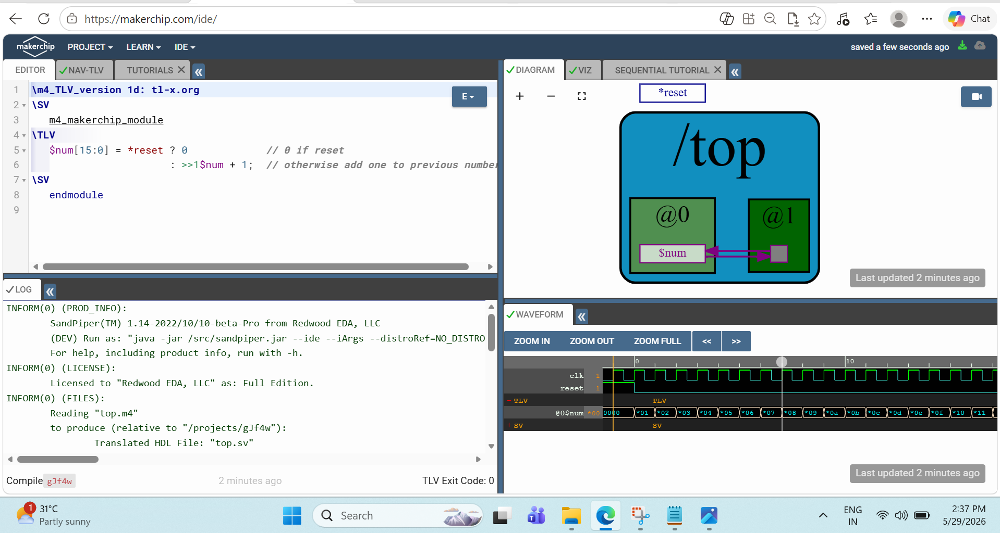

---

## Analysis

The waveform demonstrates that the output changes only after clock events.

Each new value depends on the previously stored value.

This confirms the presence of state within the design.

Unlike combinational logic, the circuit remembers information from earlier cycles.

---

## Engineering Observation

This experiment helped me understand that sequential circuits are fundamentally different from combinational circuits.

Instead of reacting only to inputs, they maintain internal state that evolves over time.

This capability is essential for implementing processor registers and control logic.

---

# Sequential Logic Lab 2 – Fibonacci Series Generator

After understanding counters, I explored a more advanced sequential circuit capable of generating a Fibonacci sequence.

Unlike a counter, which increments by a fixed amount, the Fibonacci sequence depends on multiple previous values.

This makes it an excellent example of state-dependent computation.

---

## Why Fibonacci?

The Fibonacci sequence demonstrates how hardware can:

- Store multiple values
- Perform iterative calculations
- Generate evolving outputs

Each value depends on the two preceding values.

This naturally requires memory.

---

## Practical Evidence

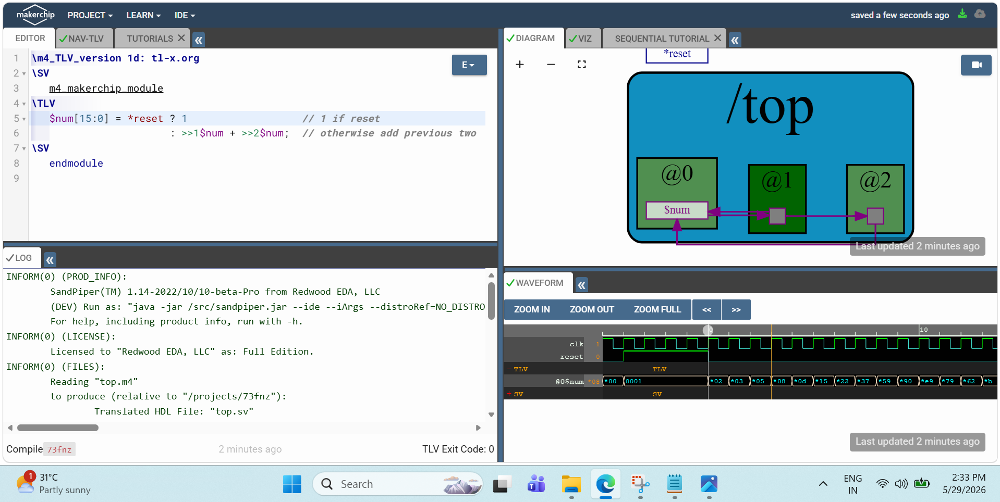

---

## Analysis

The waveform shows the progressive generation of Fibonacci numbers over time.

Each new output is computed using values stored from previous cycles.

This demonstrates how sequential circuits can implement algorithms that depend on historical information.

---

## Key Learning

This experiment revealed how hardware can implement iterative computations by combining state retention with arithmetic operations.

---

# Sequential Logic Lab 3 – Sequential Calculator

After studying counters and sequence generation, I explored a calculator design that incorporates state into the computation process.

Unlike the combinational calculator developed earlier, this version remembers previous results and uses them in future calculations.

---

## Objective

Create a calculator capable of:

```text
Perform Calculation
        ↓
Store Result
        ↓
Reuse Result
        ↓
Perform Next Calculation
```

This introduces the concept of feedback.

---

# Understanding Feedback

Feedback occurs when the output of a circuit is routed back into its input.

This enables hardware to build upon previous computations.

Many processor structures rely heavily on feedback mechanisms.

Examples include:

- Program Counters
- Accumulators
- State Machines
- Pipeline Registers

---

## Practical Evidence

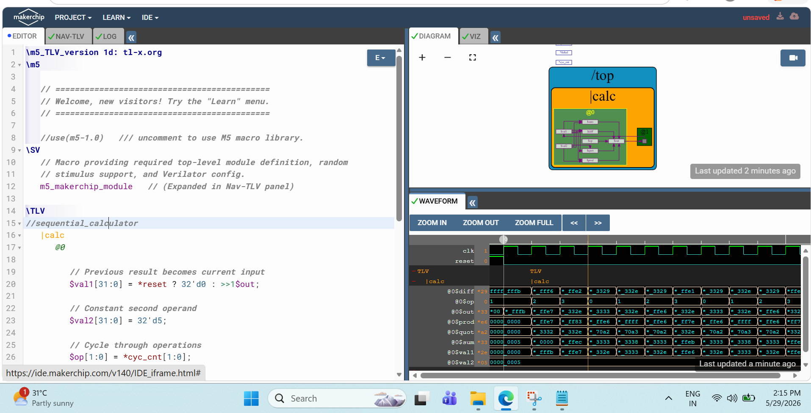

---

## Analysis

The waveform demonstrates how results generated in previous cycles are reused in future calculations.

Rather than computing each output independently, the calculator accumulates information over time.

This behavior is only possible because the circuit maintains state.

---

## Engineering Observation

This experiment helped me understand one of the most important ideas in digital design:

> Memory transforms simple combinational logic into intelligent behavior.

By retaining and reusing information, hardware can perform significantly more sophisticated operations.

---

# Understanding Feedback-Based Computation

Many real-world digital systems use feedback loops.

A feedback path allows previously generated outputs to influence future behavior.

Without feedback:

```text
Input
   ↓
Output
```

With feedback:

```text
Input
   ↓
Output
   ↓
Feedback
   ↓
Future Output
```

This concept becomes increasingly important when studying pipelines and processor design.

---

# Part 3 Reflection

Part 3 introduced one of the most important transitions in digital design:

```text
Combinational Logic
        ↓
Sequential Logic
        ↓
State Retention
        ↓
Feedback
        ↓
Processor Foundations
```

Through counters, Fibonacci generators, and sequential calculators, I observed how hardware can store information, reuse previous results, and perform computations that evolve over time.

These concepts form the foundation for understanding processor pipelines, state machines, and complex digital systems explored later in the workshop.
# Investigating Pipeline Logic

After understanding combinational and sequential logic, I encountered a new challenge.

Although sequential circuits can store information and perform computations over multiple cycles, they still execute operations one step at a time.

This creates a performance limitation.

Imagine a processor executing millions of instructions.

If every instruction had to completely finish before the next one started, the processor would spend a significant amount of time waiting.

This raises an important question:

> How can hardware perform more work without increasing clock frequency?

The answer lies in **Pipeline Logic**.

Pipeline design allows multiple operations to be processed simultaneously by dividing a computation into smaller stages.

This concept forms the foundation of modern processor architecture.

---

# Understanding the Idea of Pipelining

An intuitive way to understand pipelining is through an assembly line.

Consider manufacturing a product.

Without pipelining:

```text
Product 1 Complete
        ↓
Product 2 Complete
        ↓
Product 3 Complete
```

Only one product is processed at a time.

---

With pipelining:

```text
Stage 1 → Product A

Stage 2 → Product B

Stage 3 → Product C
```

Multiple products move through different stages simultaneously.

Although the total work remains the same, throughput increases significantly.

Processors apply exactly the same concept to instruction execution.

---

# Why Pipelines Matter

Modern processors execute instructions through multiple stages.

Examples include:

```text
Instruction Fetch
        ↓
Instruction Decode
        ↓
Execute
        ↓
Memory Access
        ↓
Write Back
```

Instead of waiting for one instruction to finish completely, different instructions can occupy different stages simultaneously.

This dramatically improves performance.

---

## Engineering Observation

One important realization from this section was that pipelining does not make individual operations faster.

Instead, it increases the number of operations completed within a given period of time.

This distinction between:

```text
Latency
```

and

```text
Throughput
```

is fundamental to processor design.

---

# Understanding Latency and Throughput

While studying pipelines, I encountered two important performance metrics.

### Latency

Latency refers to the time required for a single operation to travel from the beginning of the pipeline to the end.

---

### Throughput

Throughput refers to the number of operations completed per unit time.

---

## Key Insight

Pipeline design often keeps latency similar while dramatically increasing throughput.

This makes pipelines one of the most effective performance optimization techniques in processor architecture.

---

# Pipeline Logic Lab 1 – Pythagorean Theorem Implementation

To understand how pipelining works in practice, I implemented a design based on the Pythagorean Theorem.

The objective was not simply to calculate a mathematical result.

Instead, the goal was to observe how a computation can be divided into multiple stages and distributed across time.

---

## Problem Statement

The Pythagorean relationship is:

```
c² = a² + b²
```

The calculation involves:

1. Squaring input A
2. Squaring input B
3. Adding both results
4. Producing the final output

These operations make an excellent candidate for pipelining.

---

## Practical Evidence

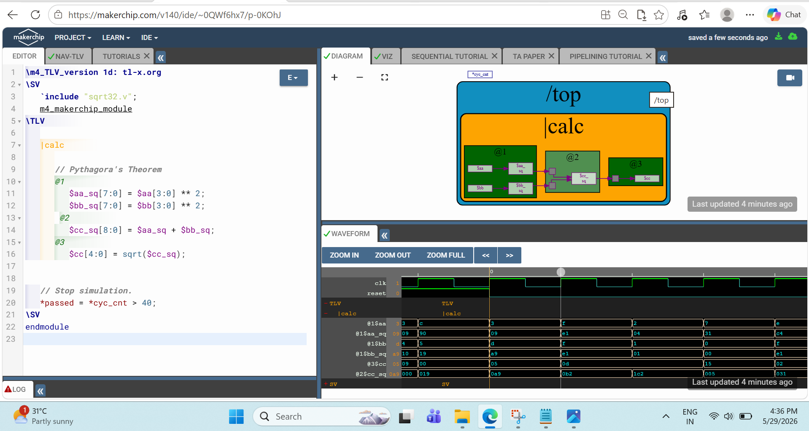

---

## Analysis

The simulation demonstrates how different stages of the computation are distributed across multiple cycles.

Rather than performing every operation within a single stage, the design separates the workload into smaller pipeline stages.

This allows intermediate results to flow through the pipeline in an organized manner.

---

## Engineering Observation

This experiment demonstrated one of the most important ideas in hardware design:

> Large computations become easier to manage when divided into smaller stages.

This same philosophy is used extensively in processor pipelines.

---

# Understanding Pipeline Stages

While analyzing the Pythagorean implementation, I observed that a pipeline consists of multiple independent processing stages.

Each stage performs a specific task.

Example:

```text
Stage 1 → Input Processing

Stage 2 → Intermediate Computation

Stage 3 → Final Result Generation
```

At every clock cycle, data advances to the next stage.

This creates a continuous flow of information through the system.

---

# Pipeline Logic Lab 2 – Retiming

After understanding basic pipelining, I explored a technique known as:

```text
Retiming
```

Retiming involves redistributing logic across pipeline stages to improve timing behavior.

Rather than changing functionality, retiming changes where computations occur.

---

## Why Retiming Matters

As designs become larger:

- Critical paths increase
- Timing violations become more likely
- Clock frequency becomes harder to maintain

Retiming helps balance the workload between stages.

---

## Practical Evidence

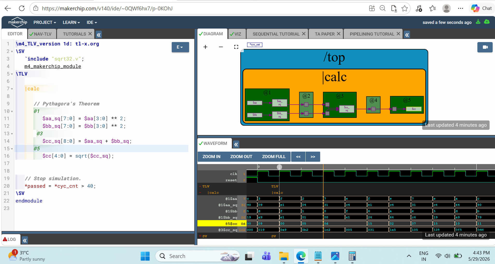

---

## Analysis

The retimed implementation distributes computations more evenly across pipeline stages.

This reduces the amount of work performed within any individual stage.

As a result, the design becomes easier to meet timing requirements.

---

## Engineering Observation

One of the most interesting lessons from this experiment was that hardware optimization often involves reorganizing computations rather than changing them.

The functionality remains identical, but the implementation becomes more efficient.

---

# Understanding Pipeline Registers

Pipeline stages are separated using registers.

These registers perform two important functions:

### Data Storage

They store intermediate results between stages.

### Synchronization

They ensure that information advances through the pipeline in a controlled manner.

Without pipeline registers, stage boundaries would not exist.

---

# Pipeline Logic Lab 3 – Three Stage Pipeline

After studying retiming, I investigated a dedicated three-stage pipeline implementation.

This experiment provided a clearer understanding of how information flows through multiple processing stages.

---

## Practical Evidence

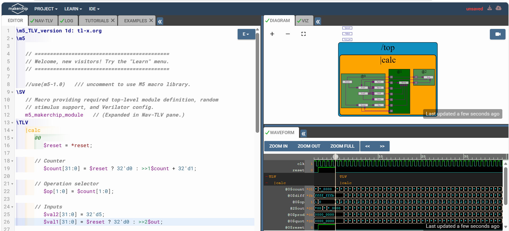

---

## Analysis

The waveform illustrates how different pieces of data occupy different stages simultaneously.

At any given clock cycle:

- One value enters the pipeline.
- Another value moves through an intermediate stage.
- A third value exits the pipeline.

This demonstrates true parallelism within hardware.

---

## Engineering Observation

This experiment helped me understand why pipelines are essential in modern processors.

Even though each instruction still requires multiple stages to complete, multiple instructions can be processed concurrently.

This significantly improves overall system performance.

---

# Understanding Hierarchical Pipeline Design

As pipeline complexity increases, managing the design becomes increasingly difficult.

To address this challenge, hierarchical design techniques are used.

Instead of constructing one large pipeline block, smaller modules are developed and integrated together.

Benefits include:

- Improved readability
- Easier verification
- Better scalability
- Higher reusability

These principles are widely used in industrial processor development.

---

# Part 4 Reflection

Part 4 introduced one of the most influential concepts in digital system design:

```text
Computation
        ↓
Sequential Execution
        ↓
Pipeline Stages
        ↓
Parallel Processing
        ↓
Higher Throughput
```

Through Pythagorean implementations, retiming experiments, and multi-stage pipelines, I gained a much deeper understanding of how hardware designers improve performance without simply increasing clock frequency.

Most importantly, I began seeing the direct connection between digital logic concepts and the processor pipelines that power modern computing systems.
# Investigating Validity in TL-Verilog

After understanding how data moves through pipelines, I encountered another important challenge.

Pipelines continuously process information across multiple stages.

However, not every piece of data entering the pipeline is always useful.

This raises an important question:

> How can hardware distinguish between valid and invalid data?

Traditional RTL designs often require designers to manually create additional control logic for managing data movement.

As pipelines become larger, this quickly increases design complexity.

TL-Verilog introduces a powerful abstraction called:

```text
Validity
```

which simplifies this process.

---

# Why Validity Matters

Consider a pipeline processing multiple pieces of information.

Some pipeline entries may contain:

- Useful data
- Intermediate results
- Empty transactions
- Invalid values

Without a mechanism for identifying valid data, every stage would unnecessarily process information.

This leads to:

- Increased switching activity
- Wasted power
- Additional control logic
- Reduced design efficiency

Validity solves this problem by explicitly tracking whether data should continue through the pipeline.

---

## Understanding the Concept of Valid Data

Instead of treating all pipeline entries equally, TL-Verilog associates each transaction with a validity condition.

Conceptually:

```text
Valid Data
      ↓
Process
      ↓
Propagate
```

while:

```text
Invalid Data
      ↓
Ignore
      ↓
Do Not Process
```

This allows hardware resources to focus only on meaningful work.

---

## Engineering Observation

One of the most interesting insights from this section was realizing that processor performance is not only about executing operations faster.

Modern hardware must also avoid performing unnecessary work.

Validity helps achieve this goal efficiently.

---

# Understanding Pipeline Gating

When validity is introduced, pipeline stages can selectively enable or disable processing.

This concept is closely related to:

```text
Clock Gating
```

and

```text
Power Optimization
```

techniques used in commercial processor designs.

---

## Why Is This Important?

Modern processors contain:

- Billions of transistors
- Deep pipelines
- Multiple execution units

If every component switched continuously, power consumption would become excessive.

Validity allows activity to occur only when useful data is present.

This significantly improves efficiency.

---

# Validity Lab 1 – Understanding Transaction Flow

To understand validity behavior, I investigated how transactions propagate through a pipeline.

The objective was to observe how valid information moves from one stage to another while invalid transactions are filtered out.

---

## Practical Evidence

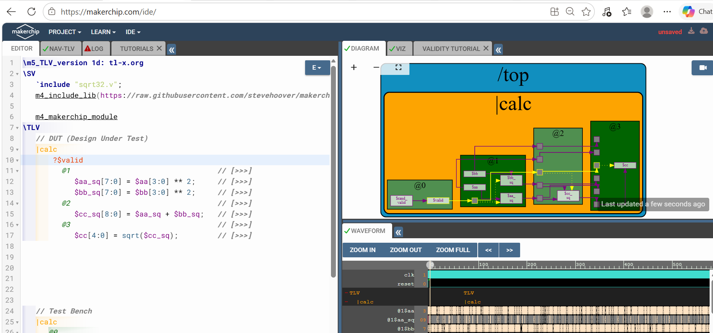

---

## Analysis

The waveform demonstrates how validity information accompanies data as it moves through the pipeline.

When a transaction is marked valid, it continues through successive stages.

Invalid transactions do not participate in computation.

This behavior prevents unnecessary activity inside the pipeline.

---

## Engineering Observation

This experiment demonstrated that validity acts as a form of intelligent traffic control.

Instead of blindly processing every signal, the pipeline becomes aware of which transactions actually matter.

---

# Understanding Distance Accumulation

After studying validity, I explored a more sophisticated pipeline application involving distance accumulation.

This example combines:

- Arithmetic Operations
- Pipeline Processing
- State Propagation
- Validity Tracking

making it an excellent demonstration of real-world TL-Verilog capabilities.

---

## Problem Statement

The objective was to continuously accumulate values while ensuring that only valid transactions contribute to the final result.

This requires coordination between:

```text
Data
      ↓
Pipeline Stages
      ↓
Validity Signals
      ↓
Accumulated Result
```

---

## Practical Evidence


---

## Analysis

The simulation output demonstrates the accumulation of values across multiple stages.

Only valid transactions contribute to the running result.

This illustrates how arithmetic computation and validity tracking work together within a pipelined system.

---

## Key Learning

This experiment showed how TL-Verilog allows complex dataflow behavior to be expressed with significantly less control logic than traditional RTL approaches.

---

# Investigating Error Detection and Comparison Logic

Reliable hardware systems must continuously verify that data remains correct throughout processing.

To explore this concept, I studied a comparison-based pipeline capable of identifying mismatches and detecting errors.

---

## Why Error Detection Matters

Modern digital systems rely heavily on verification mechanisms.

Examples include:

- Processor Verification
- Communication Protocols
- Memory Systems
- Safety-Critical Applications

Without error detection, incorrect computations could propagate through the system unnoticed.

---

## Practical Evidence

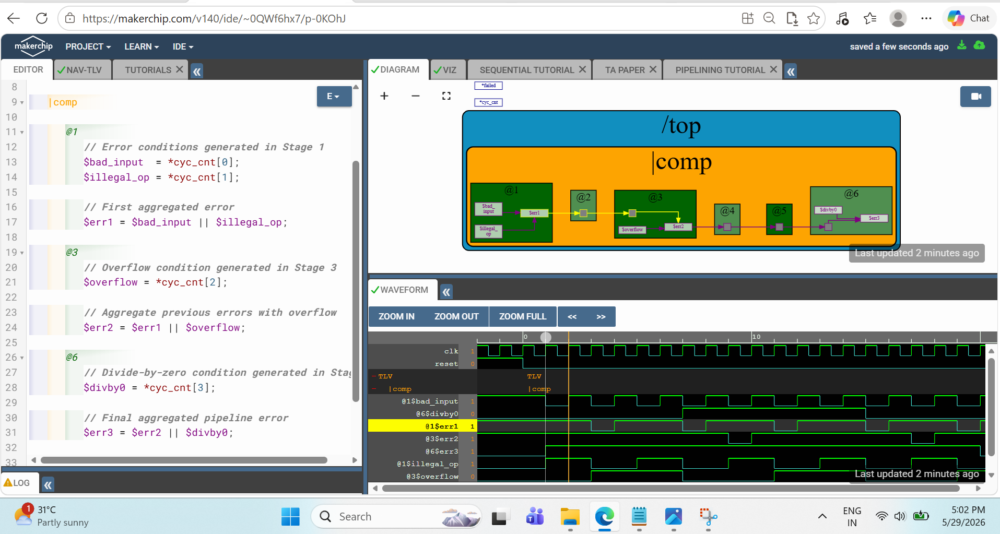

---

## Analysis

The waveform demonstrates comparison logic operating on incoming values.

Whenever mismatches occur, the detection logic identifies them and generates appropriate outputs.

This illustrates how hardware can continuously monitor correctness during operation.

---

## Engineering Observation

One of the key lessons from this experiment was that hardware design involves more than computation.

Equally important is ensuring that computations remain correct.

This principle forms the foundation of modern verification methodologies.

---

# Connecting Validity to Processor Design

While studying validity, I began seeing clear connections to processor architecture.

Many processor structures depend on similar concepts:

### Instruction Pipelines

Only valid instructions should progress through execution stages.

### Hazard Handling

Invalid operations may need to be flushed or discarded.

### Branch Prediction Recovery

Incorrect instruction paths must be invalidated.

### Power Optimization

Unused hardware resources should remain inactive.

Validity provides a clean framework for managing these situations.

---

# Why TL-Verilog Stands Out

Throughout Day 03, I explored:

- Combinational Logic
- Sequential Logic
- Pipeline Logic
- Validity

What became increasingly clear was that TL-Verilog simplifies many tasks that would otherwise require substantial manual RTL coding.

Key advantages include:

- Timing Abstraction
- Pipeline Abstraction
- Reduced Boilerplate Logic
- Improved Readability
- Faster Development

These features allow designers to focus more on functionality and less on implementation complexity.

---

# Key Takeaways from Day 03

Throughout this session, I learned:

- The role of logic gates in digital systems.
- How combinational circuits process information.
- How sequential circuits retain state.
- The importance of clocks and synchronization.
- How pipelines improve throughput.
- The purpose of retiming.
- The benefits of hierarchical design.
- How validity simplifies pipeline management.
- How TL-Verilog abstracts timing complexity.
- How modern hardware systems organize computation.

Most importantly, I learned that large digital systems are not built as monolithic structures.

Instead, they are constructed through layers of abstraction that progressively transform simple logic into sophisticated hardware architectures.

---

# My Understanding After Day 03

Day 01 taught me:

```text
How Software Becomes Instructions
```

Day 02 taught me:

```text
How Instructions Interact with Hardware
```

Day 03 taught me:

```text
How Hardware Itself Is Built
```

The complete learning progression can now be summarized as:

```text
Logic Gates
      ↓
Combinational Logic
      ↓
Sequential Logic
      ↓
Pipeline Logic
      ↓
Validity
      ↓
Hardware System Design
```

This day provided the digital design foundation required for understanding processor microarchitecture and implementing a complete RISC-V CPU in the upcoming workshop sessions.

---

# References

- NASSCOM RISC-V MYTH Program
- Makerchip Platform
- TL-Verilog Documentation
- Redwood EDA
- Workshop Labs and Exercises

---

[⬅ Back to Repository Home](../README.md)