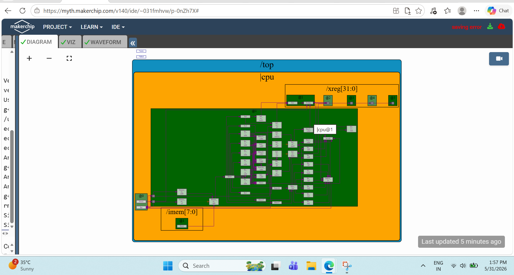
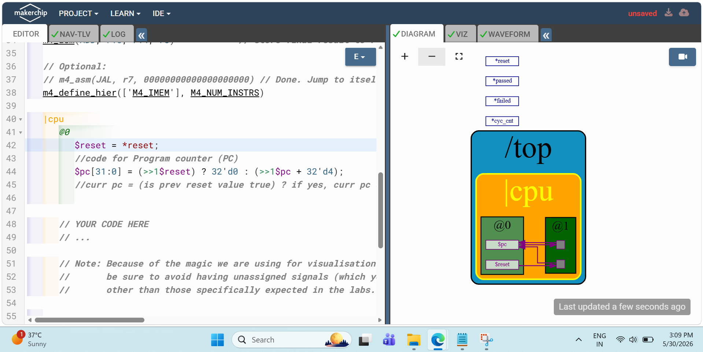
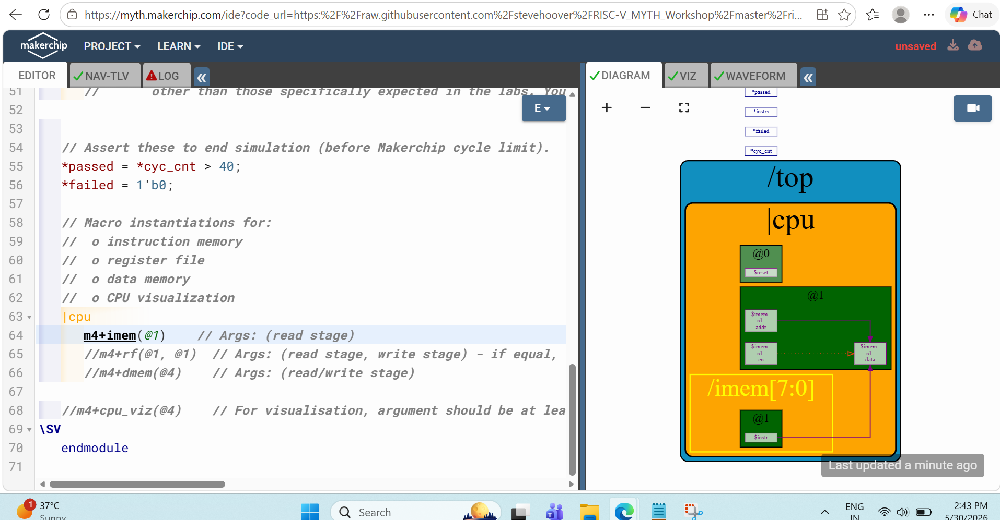
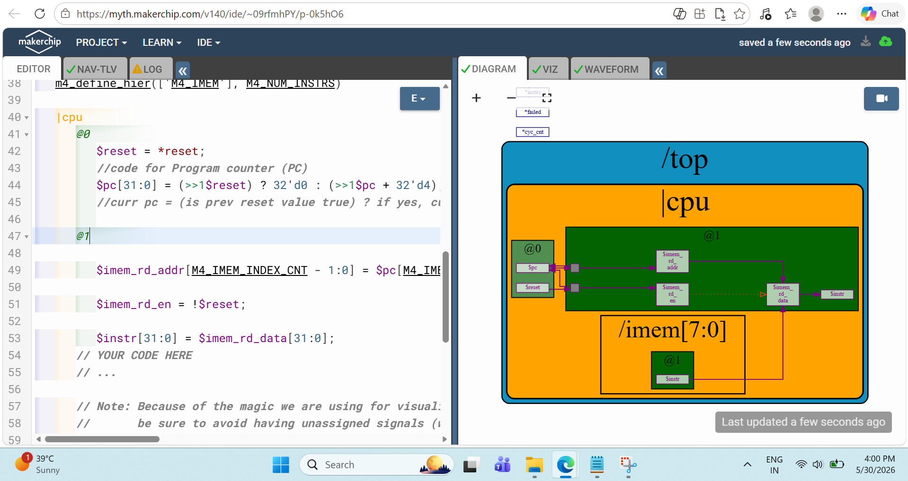
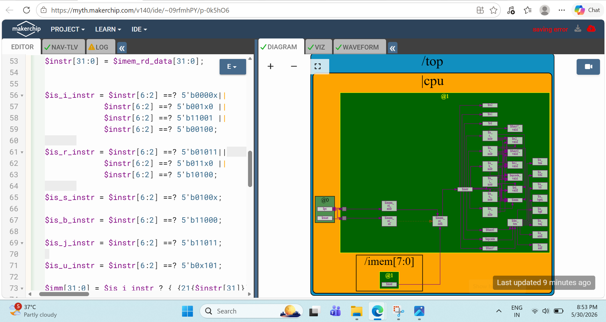
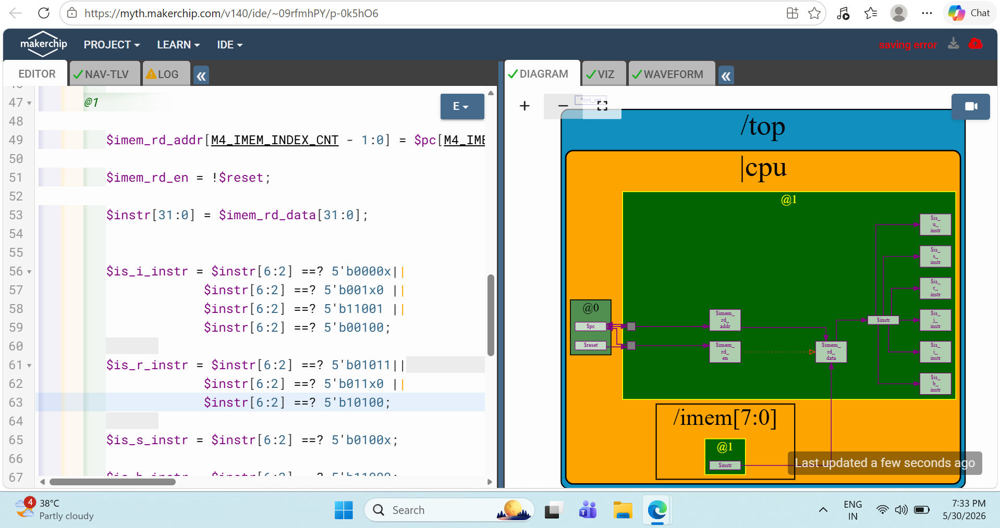
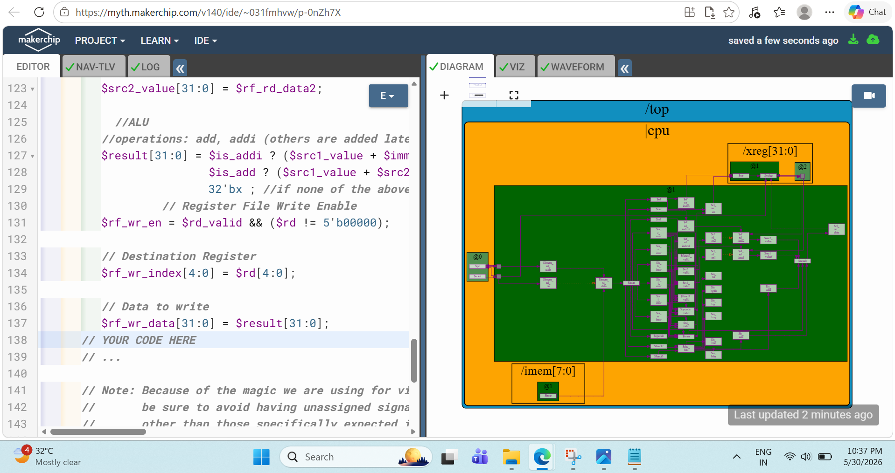

# Day 04 – Building a RISC-V CPU: From Architecture to Execution

## Overview

Day 04 was where the workshop started feeling like real processor design.

Until Day 03, I had explored digital logic, combinational circuits, sequential circuits, and pipelining concepts. On Day 04, I began connecting those concepts to understand how an actual RISC-V processor is organized internally.

The focus of this session was not on writing software, but on understanding how a processor fetches instructions, decodes them, accesses registers, performs computations, and produces results.

---

## What I Explored

Topics covered during Day 04:

- ISA vs Microarchitecture
- Program Counter (PC)
- Instruction Memory
- Fetch Logic
- Decode Logic
- Register File
- Arithmetic Logic Unit (ALU)
- CPU Datapath Integration

---

# Understanding CPU Microarchitecture

One of the most important concepts introduced during this session was the difference between an Instruction Set Architecture (ISA) and a Microarchitecture.

The ISA defines what instructions a processor supports, while the Microarchitecture defines how those instructions are implemented internally.

For the first time, I started viewing a processor not as a black box, but as a collection of hardware blocks working together to execute instructions.

---

# High-Level CPU Organization

### Processor Architecture Overview



### What I Observed

A processor is composed of several interconnected hardware blocks:

```text
Program Counter
       ↓
Instruction Memory
       ↓
Instruction Decode
       ↓
Register File
       ↓
ALU
       ↓
Result
```

Every instruction travels through this path before producing an output.

---

# Program Counter (PC)

The Program Counter is responsible for tracking which instruction should be executed next.

### Output



### What I Learned

The PC continuously generates instruction addresses and updates after every instruction.

For sequential execution:

```text
PC = PC + 4
```

Since each RISC-V instruction occupies 4 bytes, the processor advances through memory in steps of four.

This was my first practical understanding of how processors maintain execution flow.

---

# Instruction Memory

Once the Program Counter generates an address, the processor retrieves the corresponding instruction from Instruction Memory.

### Output



### What I Learned

Instruction Memory acts as the processor's source of executable code.

Although software is written in C or Assembly, the processor ultimately works only with machine instructions stored in memory.

This helped me understand where instructions actually come from during execution.

---

# Fetch Stage

After understanding the PC and Instruction Memory individually, I explored how they work together to fetch instructions.

### Output



### What I Observed

The fetch stage continuously performs:

```text
Program Counter
       ↓
Instruction Address
       ↓
Instruction Memory
       ↓
Fetched Instruction
```

This stage serves as the entry point for every instruction executed by the processor.

Without instruction fetch, no downstream stage can function.

---

# Fetch Verification

To verify the fetch mechanism, I observed the interaction between the Program Counter and Instruction Memory.

### Output



### What I Learned

The verification output confirmed:

- PC values update correctly.
- Instructions are fetched successfully.
- Instruction flow remains continuous.
- Instructions are forwarded to the next stage.

This provided confidence that the processor could reliably retrieve instructions from memory.

---

# Decode Stage

Once an instruction is fetched, the processor must determine what operation it represents.

This responsibility belongs to the Decode Stage.

### Output



### What I Learned

The decode stage extracts important instruction fields such as:

```text
Opcode
rs1
rs2
rd
Immediate Values
```

Using this information, the processor identifies:

- Arithmetic Instructions
- Logical Instructions
- Load Instructions
- Store Instructions
- Branch Instructions

For me, this was the stage where raw binary instructions started becoming meaningful processor actions.

---

# Register File

Before executing an instruction, the processor must retrieve the required operands.

These operands are stored inside the Register File.

### What I Learned

The Register File acts as the processor's working memory.

For an instruction such as:

```assembly
add x5, x1, x2
```

the processor must:

```text
Read x1
Read x2
Perform Addition
Store Result
```

This helped me understand how instructions interact with data.

---

# Arithmetic Logic Unit (ALU)

The ALU is responsible for performing computations inside the processor.

### Output



### What I Observed

The ALU performs:

- Addition
- Subtraction
- Logical Operations
- Comparisons
- Branch Evaluations

This was the first stage where the processor actually started producing meaningful results from instructions.

---

# Execution Flow

After combining Decode, Register Access, and ALU operations, the execution path became much clearer.

```text
Instruction
      ↓
Decode
      ↓
Register Read
      ↓
ALU Execution
      ↓
Result Generation
```

This helped me understand how processors transform instruction information into actual computation.

---

# Integrating the Complete CPU

The final step of Day 04 was observing how all processor stages work together.

### Final Integrated Output


### What I Observed

The integrated processor successfully demonstrated:

- Instruction Fetch
- Instruction Decode
- Register Access
- ALU Execution
- Result Generation

At this stage, the processor was no longer a collection of separate modules but a complete execution system.

---

# Key Takeaways

By the end of Day 04, I was able to:

- Understand the difference between ISA and Microarchitecture.
- Explore the role of the Program Counter.
- Understand how Instruction Memory works.
- Implement and verify Fetch Logic.
- Understand instruction decoding.
- Explore Register File operations.
- Implement ALU functionality.
- Understand the complete processor datapath.
- Observe how instructions travel through a CPU.

---

# My Reflection

Day 04 was one of the most important milestones of the workshop.

The previous days focused on software execution, processor verification, and digital design concepts. This session brought everything together and showed how a processor is actually organized internally.

The biggest takeaway was realizing that instruction execution is not a single operation. Every instruction passes through multiple coordinated hardware stages before producing a result.

This understanding provided the foundation required for Day 05, where the focus shifts toward pipelining, hazards, and building a complete verified RISC-V CPU.

---

[⬅ Back to Repository Home](../README.md)