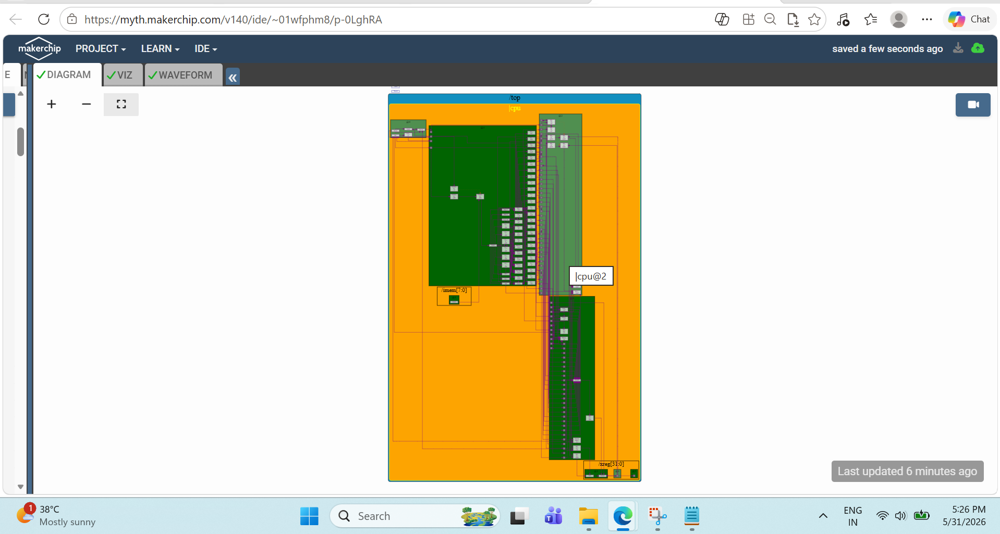
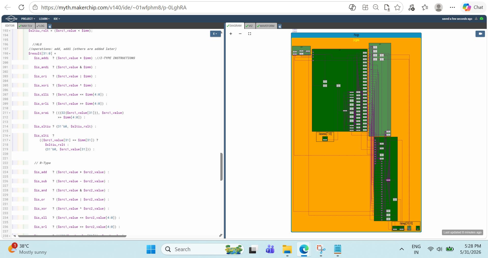

# Day 05 – Building and Verifying a Complete RISC-V Processor

## Overview

Day 05 was the final and most rewarding phase of the workshop.

During the previous sessions, I explored processor architecture, instruction execution, digital logic, and CPU microarchitecture. In this session, I focused on completing the processor by implementing memory operations, jump instructions, pipelining concepts, hazard handling, and final verification.

The goal was simple:

```text
Build a Functional RISC-V Processor
            ↓
Verify Correct Operation
            ↓
Achieve Simulation PASS
```

---

## What I Explored

Topics covered during Day 05:

- Load and Store Instructions
- Data Memory Integration
- Jump Instructions (JAL & JALR)
- Pipeline Implementation
- Valid Signal Management
- Data Hazards
- Branch Hazards
- Register Forwarding
- Processor Integration
- Final Verification

---

# Implementing Load and Store Operations

The first major enhancement was adding support for memory access instructions.

Until this stage, the processor could perform computations, but it could not interact with data memory.

### What I Learned

Load and Store instructions allow the processor to:

- Read data from memory
- Write data to memory
- Exchange information between registers and memory

This introduced the concept of address generation using:

```text
Base Register + Immediate Offset
```

which is commonly used throughout RISC-V programs.

---

# Integrating Data Memory

After implementing load and store decoding, I connected the processor to a simple data memory model.

### What I Observed

The processor could now:

```text
Register Value
      ↓
Store to Memory
      ↓
Load Back from Memory
      ↓
Write to Register
```

This was an important milestone because the processor was no longer limited to register-only operations.

---

# Verifying Load and Store Functionality

To validate memory operations, I modified the summation program.

The processor:

1. Calculated the final sum.
2. Stored the result into memory.
3. Loaded the same value back into a register.
4. Used the loaded value for verification.

### What I Learned

This test not only verified memory operations but also confirmed that the loop and branch logic were functioning correctly.

It provided confidence that data could move successfully between the processor and memory.

---

# Implementing Jump Instructions

The next feature added was support for jump instructions.

### Instructions Implemented

- JAL (Jump and Link)
- JALR (Jump and Link Register)

### What I Learned

Unlike branches, jump instructions modify the Program Counter unconditionally.

Implementing jumps helped me understand how processors alter execution flow and navigate through programs.

This was my first experience working with PC redirection mechanisms.

---

# Building the Pipeline

Once the core instruction set was working, I shifted focus to processor performance.

Instead of executing instructions one at a time, the processor was organized into pipeline stages.

### Pipeline Verification



### What I Observed

Instructions could now progress through different stages simultaneously.

This introduced:

- Better instruction throughput
- Increased hardware utilization
- More realistic processor behavior

It also introduced new challenges in the form of hazards.

---

# Understanding Pipeline Hazards

As instructions began executing in parallel, dependencies started appearing.

### Data Hazard Example

```assembly
add x5, x1, x2
sub x6, x5, x3
```

The second instruction depends on the result generated by the first.

### What I Learned

Hazards are one of the biggest challenges in processor design because they affect both:

```text
Performance
        &
Correctness
```

A processor must execute quickly while still producing correct results.

---

# Register Forwarding and Hazard Resolution

To reduce unnecessary waiting, forwarding logic was introduced.

### What I Observed

Instead of waiting for results to be written back:

```text
ALU Result
      ↓
Forwarded Directly
      ↓
Next Instruction
```

This significantly improves performance while maintaining correctness.

Understanding forwarding helped me appreciate how modern processors achieve high throughput.

---

# Integrating the Complete Processor

After implementing all major subsystems, the processor was evaluated as a complete execution engine.

### What I Observed

The processor successfully performed:

- Instruction Fetch
- Instruction Decode
- Register Access
- ALU Execution
- Memory Operations
- Program Flow Control

At this stage, the design evolved from a collection of hardware blocks into a functioning RISC-V processor.

---

# ALU Verification

To validate arithmetic and logical functionality, I analyzed processor execution under realistic conditions.

### ALU Output



### What I Learned

The ALU correctly performed computations while interacting with the decode logic, register file, and execution pipeline.

This confirmed the correctness of the processor's computational core.

---

# Final Verification

The final objective was ensuring that the processor successfully passed the Makerchip verification environment.

### Simulation Pass Confirmation


### What I Observed

The processor:

- Compiled successfully
- Executed instructions correctly
- Passed verification checks
- Reached the expected pass condition

Most importantly, the simulation concluded with:

```text
Simulation PASSED!!!
```

This confirmed that the processor implementation was functioning as intended.

---

# Key Takeaways

By the end of Day 05, I was able to:

- Implement Load and Store instructions.
- Integrate Data Memory.
- Implement JAL and JALR instructions.
- Understand pipeline timing and validity.
- Explore data and control hazards.
- Implement forwarding mechanisms.
- Integrate all processor subsystems.
- Verify ALU functionality.
- Successfully validate the processor using Makerchip.

---

# My Reflection

Day 05 was the culmination of everything learned throughout the workshop.

The journey progressed from understanding software execution to building and verifying a functional RISC-V processor.

The most rewarding moment was seeing:

```text
Simulation PASSED!!!
```

after integrating and debugging the complete design.

This workshop completely changed the way I view processors. Instead of seeing them as black boxes, I now understand how instructions move through hardware, how processor components interact, and how architectural decisions affect performance and correctness.

---

## Workshop Journey Summary

```text
Day 01 → Software & RISC-V Basics
Day 02 → ABI & Verification
Day 03 → Digital Logic & TL-Verilog
Day 04 → CPU Architecture
Day 05 → Complete RISC-V Processor
```

---

[⬅ Back to Repository Home](../README.md)