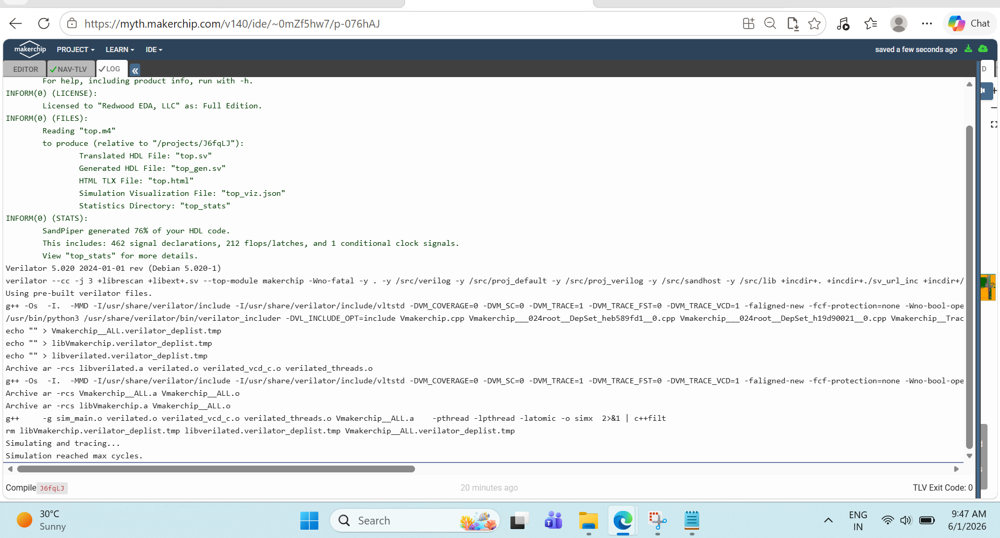

# Final Phase of RISC-V CPU Design


### 1. **Introduction to Load and Store**:
   - In RISC-V, there are different types of **load instructions** that support both signed and unsigned loads of varying data widths (bytes, half-words, full words).
   - **Signed loads** extend the upper bit based on its value (sign extension), while **unsigned loads** zero-extend the upper bits.
   - However, in this implementation, only **full word load** and **store** instructions will be supported.

### 2. **Decoding Load Instructions**:
   - For simplicity, all five types of loads are decoded to a single **is_load** signal, without distinguishing between the different types of loads (e.g., byte, half-word).
   - This approach uses the **opcode** field, which is unique to load instructions, to simplify the decoding process.

### 3. **Operation of Load Instructions**:
   - In RISC-V, the **load instruction** specifies the memory address from which data should be loaded into a destination register.
   - The address is calculated as the sum of a register value (**rs1**) and an **immediate** value (an offset).
   - This address calculation is the same as that used for the **addi** instruction.

### 4. **Operation of Store Instructions**:
   - The **store instruction** writes data from a source register (**rs2**) to a memory address, which is calculated similarly using **rs1** and the **immediate**.

### 5. **Timing and Hazard in Load Instructions**:
   - A **two-cycle delay** exists between when the load address is presented and when the data is available for loading.
   - This introduces a **hazard**, as the CPU can’t write the data to the register file immediately, and must **invalidate two subsequent instructions** (to avoid conflicts in writing to the register file).

### 6. **Handling Load Hazards (Waterfall Diagram)**:
   - The earliest point at which the CPU can access the load data is **two cycles** after presenting the address.
   - In the **load shadow**, the subsequent two instructions are **invalidated** (similar to handling branch hazards) to ensure the load data can be correctly written to the register file.

### 7. **PC Redirection for Load**:
   - To handle load operations, the CPU must **redirect the PC** (program counter) to the instruction following the load, and **replay** the instruction after the load.
   - This ensures that the **load data** is written to the register file properly, and subsequent instructions operate with the correct data.

### 8. **Bypassing Load Data**:
   - Due to the register file **bypass mechanism**, the CPU must ensure that the **load data** being written to the register file is also available for bypass.
   - This allows subsequent instructions to use the **load result** immediately, without waiting for it to be written to the register file.

### 9. **Implementation Steps**:
   - **First step**: Implement the **PC redirect** for load instructions, similar to the approach used for branches. This involves clearing the **valid** signal for instructions in the **shadow** of the load.
   - **Second step**: Ensure that the **incremented PC** from three cycles ago is selected as the next PC.
   - **Next step**: Debug and test the logic to ensure the **load shadow** and redirect behave as expected.
   - After completing this, the next step would be to handle the actual **load data** and ensure it's correctly written to the register file.
## Implementation of **load data handling** and **memory address calculation** for load/store instructions in the RISC-V architecture:

### 1. **Load Data Path Implementation**:
   - After implementing the **load shadow** mechanism, the next step is to handle the actual load data.
   - We're assuming the availability of a **load data signal** from memory (though memory is not yet implemented).
   - This **load data** will be written to the **register file** two cycles after the load instruction execution.

### 2. **Steps to Implement Load and Store Logic**:
   - **Step 1: Compute Address for Loads/Stores**:
     - Both loads (identified by **is_load**) and stores (identified by **is_s_type**) need to compute an address.
     - Use the **ALU** to compute the memory address, which is the result of adding **rs1** (source register 1) and an **immediate** value (similar to the **addi** instruction).
   
   - **Step 2: Add Mux for Result and Load Data**:
     - Introduce a **mux** in front of the **result** signal.
     - This mux selects between the **ALU result** (for valid instructions) and the **load data** (for invalid instructions in the load shadow).
     - The easiest selection logic is: if the instruction is **invalid**, use the **load data**; otherwise, use the **ALU result**.
   
   - **Step 3: Control Write Enable Signal**:
     - Ensure that the **write enable** signal is asserted two cycles after the load instruction to write the load data to the register file.
     - De-assert the write for the load instruction itself, as the **ALU result** (address) should not be written to the register file.
     - Optionally, **clean up** by ensuring the load instruction does not have a valid destination register (**rd**) in the decode logic.
   
   - **Step 4: Correct Register File Index**:
     - Add a **mux** to select the correct **register file index**.
     - Two cycles after the load instruction, write the load data into the **destination register** specified by the load instruction’s **rd** field from two cycles ago.

### 3. **Important Considerations**:
   - Ensure the **load data** is written only after two cycles.
   - The **destination register index** for the load should be selected correctly based on the load instruction two cycles prior.
   - **Save** your work frequently, and verify in simulation.

### Instantiating Data Memory and Hooking it to the Logic:

1. **Data Memory Instantiation**:
   - A generic macro for **data memory** has been provided, similar to the instruction memory and register file.
   - The data memory is designed to support either **one read** or **one write** operation per cycle.
   - It has **16 entries**, each 32-bits wide (i.e., **word-wide** memory).
   - The macro is a simplified toy CPU memory setup, not a full-blown memory system.

2. **Data Memory Interface**:
   - The interface signals provided by the macro need to be hooked up appropriately for load and store operations.
   - You’ll be using:
     - **Address** signals (provided by the ALU result)
     - **Write enable** for stores
     - **Read enable** for loads
     - **Data for store** comes from **rs2** (the second source register).

3. **Address Consideration**:
   - The address provided is a **byte address**.
   - Since only **word** operations are supported, you’ll assume that the **byte address** is aligned on a word boundary:
     - The lower two bits of the byte address are ignored (they are assumed to be zero).
     - To **index the memory** with a word index, consider **address bits 5 to 2** (since the memory has 16 entries).
   
4. **Connecting Control Bits**:
   - **Write Enable**: Assert this signal for **store** operations (when there’s valid data to store).
   - **Read Enable**: Assert this signal for **load** operations (when valid data needs to be read).
   - Ensure that the memory control bits (write/read) are **only asserted for valid instructions**, preventing unintended operations.

5. **Data Memory Read**:
   - The data memory provides a **read data signal** (for load operations), which should be connected to the register file.
   - Remember to implement a **two-cycle delay** for the load data path, as it takes two cycles for load data to be written back to the register file.
   - Ensure that the **data from two cycles ago** is correctly looped back into the register file for valid instructions.

6. **Write Conditioning**:
   - Properly condition the write signal so that it does not assert during invalid cycles or when a load operation is mistakenly treated as a write.

## Testing Load and Store Instructions:

1. **Basic Testing of Load and Store**:
   - It's recommended to test load and store instructions by adding simple test cases at the end of your program.
   - This test will **store** the value in **r10** after the loop completes and then **load** that same value into **r15**.

2. **Test Process**:
   - After the **loop completes**, **r10** should hold the final summation value.
   - The summation value in **r10** will be **stored** at **address 4** (a binary address value).
   - Immediately after, the value at **address 4** is **loaded** into **r15**.

3. **Verifying the Test**:
   - The passing condition of the test will now be based on the value in **r15** (x-reg15) instead of **r10**.
   - Modify the **passing signal condition** (`star passing star past`) to check **r15** instead of **r10**.

4. **Additional Benefit**:
   - This test also verifies that the loop ends correctly:
     - Previously, the loop could continue beyond the expected iteration (if branch conditions were incorrect), and the issue wouldn't have been detected.
     - Now, by **storing** the value after the loop and **loading** it into a new register (**r15**), the loop's proper termination can be verified.
     - If the loop doesn’t terminate properly, this test may reveal a bug in the **branch less than condition**.

5. **Final Steps**:
   - Run the test to ensure the program ends properly and passes the conditions.
   - After confirming the load and store functionality, you can proceed to the next step (jump instructions).

### Key Tasks:
   - Add **store** instruction to store the value from **r10** at **address 4**.
   - Add **load** instruction to load the value from **address 4** into **r15**.
   - Modify the **passing condition** to check **r15** instead of **r10**.
   - Run the program to test the load and store instructions and verify the proper termination of the loop.
     
## Implementing Jump Instructions:

1. **Overview of Jump Instructions**:
   - There are two types of jumps to implement: 
     - **Jump and Link (JAL)**
     - **Jump and Link Register (JALR)**
   - **JAL** functions like a **branch** but without a condition, jumping to a target calculated as **PC + immediate**.
   - **JALR** calculates the target relative to a **register value (source 1)** instead of the **PC**.

2. **Implementation of JAL**:
   - **JAL** works similarly to a branch:
     - No condition needs to be evaluated.
     - Ensure the **taken branch signal** is asserted for jumps.
     - The target address is computed as **PC + immediate** (just like a branch).
     - Redirect the **PC** after the jump and insert **invalid cycles** (similar to branches and loads).

3. **Implementation of JALR**:
   - **JALR** computes the target based on the **source 1** value (the register value) instead of the **PC**.
   - A separate adder is used to compute **source 1 + immediate**.
   - To handle this properly, ensure the source 1 value comes after the **bypass mux** (to account for potential bypassing).
   - To optimize, the same adder can be reused by adding a **mux** to choose between the **PC** (for branches/JAL) and **source 1** (for JALR).
     - This requires moving the adder and introducing a control signal to select the appropriate input (PC or source 1).
   - A simpler approach is to use a separate adder for **JALR** computation, avoiding the complexity of muxes and shared resources.

4. **Steps for Implementation**:
   - **Step 1**: Define the **is jump** signal, which is the logical OR of **JAL** and **JALR** instructions.
     - For jumps, redirect the **PC** (just like for taken branches).
     - Insert **invalid cycles** after the jump (similar to what was done for branches and loads).
   
   - **Step 2**: Perform the target computation for **JAL**:
     - Compute **PC + immediate** (already done for branches).
     - This value will be used to update the **PC** when **JAL** is executed.

   - **Step 3**: Implement the computation for **JALR**:
     - Add the **source 1 value** (from the bypass mux) to the immediate value to compute the new PC for JALR.
     - Ensure this is handled in **stage 3**, as it depends on the **source 1** value.

   - **Step 4**: Select the appropriate PC for **JAL** and **JALR**:
     - For **JAL**, you can reuse the same logic as branches to update the PC.
     - For **JALR**, introduce a new path to handle the **JALR target PC**.

5. **Final Considerations**:
   - Ensure proper selection of the PC for each jump type.
   - Handle the jump instruction by creating invalid cycles after execution, similar to previous operations.
   - Once implemented, test to confirm the correct jump behavior, ensuring the program counter updates as expected.
# Part 2 – Implementing the Pipeline and Establishing Instruction Flow

## Introduction

In Part 1, I explored the motivation behind pipelining and understood why modern processors execute multiple instructions simultaneously instead of waiting for one instruction to completely finish before starting the next.

However, understanding pipelining conceptually is very different from implementing it in hardware.

The next challenge was:

> How can instructions be introduced into the processor at regular intervals without causing incorrect execution?

Before solving hazards, the processor first needed a reliable mechanism to control when instructions enter the pipeline.

This section focuses on implementing the initial pipeline timing strategy and understanding how instruction validity is managed throughout execution.

---

# Revisiting the Original CPU Design

The processor developed during Day 04 was functionally correct but intentionally conservative.

Instructions were not allowed to overlap aggressively.

The execution flow resembled:

```text
Instruction 1
      ↓
Completed

Instruction 2
      ↓
Completed

Instruction 3
      ↓
Completed
```

This approach ensured correctness but sacrificed performance.

A more efficient solution was required.

---

# Introducing a Three-Cycle Pipeline Cadence

Before attempting a fully optimized pipeline, the processor was first organized around a predictable execution rhythm.

The design adopted a:

```text
Three-Cycle Cadence
```

This means a new valid instruction enters the pipeline every three clock cycles.

Conceptually:

```text
Cycle 1  → Instruction A

Cycle 2  → Internal Processing

Cycle 3  → Internal Processing

Cycle 4  → Instruction B

Cycle 5  → Internal Processing

Cycle 6  → Internal Processing

Cycle 7  → Instruction C
```

Although this is not yet maximum performance, it provides a stable foundation for later optimization.

---

# Why Start with a Three-Cycle Cadence?

A natural question arises:

> Why not immediately execute one instruction every clock cycle?

The answer lies in verification complexity.

When developing a processor, it is important to establish correctness before introducing aggressive optimizations.

The three-cycle cadence provides:

### Controlled Instruction Flow

Instructions are separated sufficiently to avoid immediate hazards.

### Easier Debugging

Signal behavior becomes easier to observe and verify.

### Stable Validation Environment

Each stage can be tested independently.

### Incremental Development

Pipeline hazards can be solved gradually rather than all at once.

This engineering approach significantly reduces debugging effort.

---

# Understanding the Valid Signal

One of the most important concepts introduced during this stage was the **Valid Signal**.

The valid signal determines whether an instruction currently present in the pipeline should be considered active.

Conceptually:

```text
Valid = 1
```

means:

```text
This instruction should execute.
```

while:

```text
Valid = 0
```

means:

```text
Ignore this instruction.
```

The valid signal acts as a traffic controller for the processor pipeline.

---

# Why the Valid Signal Is Necessary

As processors become more sophisticated, not every instruction fetched should necessarily execute.

Examples include:

- Branch recovery
- Load hazards
- Pipeline flushing
- Speculative execution recovery

The valid signal provides a mechanism to selectively disable instructions when required.

Even though the processor is still operating in a simple three-cycle cadence, introducing validity control early simplifies future hazard handling. :contentReference[oaicite:0]{index=0}

---

# Generating Pipeline Activity

To establish a predictable instruction pattern, a start signal was used after reset.

The purpose of this logic was:

1. Wait until reset completes.
2. Inject the first valid instruction.
3. Maintain the execution rhythm.

Conceptually:

```text
Reset Released
        ↓
Start Signal Generated
        ↓
Valid Instruction Inserted
        ↓
Pipeline Begins Operating
```

This marks the beginning of instruction flow through the processor.

---

# Understanding Pipeline Timing

One of the key lessons from this section was realizing that processor design is heavily dependent on timing.

It is not enough for logic to be correct.

Logic must also become available at the correct cycle.

For example:

```text
Instruction Fetch
        ↓
Decode
        ↓
Register Read
        ↓
Execute
```

Each stage requires information generated by previous stages.

Incorrect timing causes:

- Invalid results
- Register corruption
- Branch failures
- Incorrect instruction execution

This makes timing analysis a critical part of processor development.

---

# Practical Investigation

To verify pipeline behavior, I observed the execution timeline and monitored how instructions progressed through the processor.

The objective was to ensure:

- Instructions entered the pipeline correctly.
- Stage transitions occurred as expected.
- ALU updates happened at the correct time.
- No unintended instruction interactions occurred.

---

## Practical Evidence


---

## Analysis

The waveform demonstrates the progression of instructions through the processor pipeline.

Several observations can be made:

### Controlled Instruction Entry

Instructions enter the pipeline in a predictable pattern.

### Stage Synchronization

Each stage receives valid information at the appropriate cycle.

### Correct ALU Activation

The ALU performs computations only after operands become available.

### Stable Timing Behavior

Signal transitions occur in a deterministic manner.

These observations confirm that the basic pipeline timing structure is functioning correctly.

---

# Engineering Observation

Before studying processor design, I often assumed that hardware execution occurred instantaneously.

This investigation revealed a much more interesting reality.

Every operation inside a processor is governed by timing relationships.

Even a simple addition requires:

```text
Instruction Fetch
        ↓
Decode
        ↓
Operand Retrieval
        ↓
Execution
        ↓
Write Back
```

Each step occupies a specific position within the pipeline.

Understanding these relationships is essential for designing reliable hardware.

---

# Preparing for Hazard Resolution

Although the three-cycle cadence avoids many immediate hazards, it is not the final goal.

Modern processors strive to execute instructions much more aggressively.

To achieve this, the processor must eventually support:

```text
Nearly One Instruction Per Cycle
```

However, this introduces new challenges:

- Register dependencies
- Branch dependencies
- Load-use hazards

The current pipeline framework provides the foundation needed to tackle these problems in subsequent sections. :contentReference[oaicite:1]{index=1}

---

# Key Learning

Through this section, I learned:

- Why pipelining requires careful timing control.
- The purpose of a three-cycle execution cadence.
- How valid signals manage instruction flow.
- Why timing correctness is as important as functional correctness.
- How instructions progress through pipeline stages.
- How waveform analysis helps verify processor behavior.

Most importantly, I learned that successful processor design depends on controlling not only what happens, but also when it happens.

---

# Part 2 Reflection

This section transformed pipelining from a theoretical concept into an actual hardware implementation.

The processor now possesses:

```text
Instruction Timing Control
        ↓
Pipeline Validity Control
        ↓
Stage Synchronization
        ↓
Verified Execution Flow
```

These capabilities establish the foundation required for the next major challenge:

```text
Pipeline Hazards
        ↓
Register Dependencies
        ↓
Branch Dependencies
        ↓
Hazard Resolution
```

which ultimately enables the processor to move toward higher-performance instruction execution.
# Part 3 – Solving Pipeline Hazards and Improving Instruction Throughput

## Introduction

By this stage, the processor was capable of:

- Fetching instructions
- Decoding instructions
- Executing arithmetic operations
- Maintaining pipeline timing
- Controlling instruction validity

While the pipeline was functioning correctly, another challenge immediately became apparent.

As instructions began flowing through the processor simultaneously, they started interacting with each other.

This introduced a new class of problems known as:

# Pipeline Hazards

Pipeline hazards occur when instruction execution order creates conflicts that may lead to incorrect results.

Understanding and solving these hazards is one of the most important aspects of modern processor design.

A processor that ignores hazards may execute instructions quickly, but it will not execute them correctly.

Therefore, the objective of this phase was:

```text
Improve Performance
        ↓
Maintain Correctness
        ↓
Resolve Hazards
```

---

# Understanding Data Dependencies

Consider the following sequence:

```assembly
add x5, x1, x2
sub x6, x5, x3
```

At first glance, these instructions appear independent.

However, a closer inspection reveals that the second instruction depends on the result generated by the first instruction.

```text
Instruction 1
Produces x5
        ↓
Instruction 2
Requires x5
```

This relationship is known as a dependency.

Dependencies are extremely common in real software and therefore must be handled correctly by the processor.

---

# The Read-After-Write Hazard

The most common hazard encountered in pipelined processors is the:

```text
Read After Write (RAW) Hazard
```

This occurs when:

1. An instruction produces a result.
2. A following instruction immediately requires that result.
3. The value has not yet been written back.

Example:

```assembly
add x5, x1, x2
sub x6, x5, x3
```

The ADD instruction generates x5.

The SUB instruction attempts to read x5.

If the ADD operation has not completed, the SUB instruction may receive an incorrect value.

This leads to incorrect program execution.

---

# Why This Hazard Occurs

To understand the problem, consider the pipeline timeline.

```text
Cycle 1
ADD Fetch

Cycle 2
ADD Decode
SUB Fetch

Cycle 3
ADD Execute
SUB Decode

Cycle 4
ADD Write Back
SUB Execute
```

Notice that the SUB instruction may require the value before the ADD instruction has fully completed.

The pipeline is operating correctly from a timing perspective, but data availability becomes the issue.

This is one of the fundamental challenges introduced by pipelining.

---

# Traditional Solution: Pipeline Stalls

One possible solution is to pause execution.

The processor waits until the required value becomes available.

Conceptually:

```text
Instruction A
        ↓
Wait
        ↓
Wait
        ↓
Instruction B
```

Although this approach guarantees correctness, it introduces a major disadvantage:

```text
Performance Loss
```

The processor spends valuable cycles doing no useful work.

Modern processors therefore seek better solutions whenever possible.

---

# Understanding Register Bypassing

To reduce unnecessary waiting, processors implement a technique known as:

# Register Bypassing

Also called:

```text
Forwarding
```

Instead of waiting for the result to be written back to the register file, the processor directly forwards the newly computed value to the instruction that requires it.

Conceptually:

```text
ALU Result
        ↓
Forward Directly
        ↓
Next Instruction
```

This eliminates unnecessary stalls and significantly improves performance.

---

# Why Forwarding Improves Performance

Without forwarding:

```text
ADD
 ↓
Write Back
 ↓
SUB Executes
```

With forwarding:

```text
ADD Executes
 ↓
Forward Result
 ↓
SUB Executes Immediately
```

The second instruction no longer needs to wait for the entire write-back process.

This improves instruction throughput while maintaining correctness.

---

# Understanding Branch Hazards

Data hazards are not the only challenge introduced by pipelining.

Branch instructions create another category of hazards.

Example:

```assembly
beq x1, x2, target
```

The processor does not immediately know whether the branch condition will be true or false.

However, instruction fetching must continue.

This creates uncertainty regarding the next instruction.

```text
Branch Instruction
        ↓
Decision Pending
        ↓
Unknown Next PC
```

This is known as a:

```text
Control Hazard
```

---

# Why Branch Hazards Are Difficult

A branch decision influences the Program Counter.

The Program Counter determines:

```text
Which instruction should be fetched next?
```

If the processor guesses incorrectly, it may begin executing instructions that should never have executed.

As a result:

- Incorrect instructions enter the pipeline.
- Processor resources are wasted.
- Pipeline flushing may become necessary.

Branch handling is therefore one of the most critical aspects of processor design.

---

# Engineering Investigation

During this phase, I focused on understanding how instruction dependencies influence processor behavior.

The objective was not simply to observe hazards, but to understand:

```text
Why Hazards Occur
        ↓
How They Affect Performance
        ↓
How Modern Processors Solve Them
```

This perspective transformed hazards from theoretical concepts into practical engineering challenges.

---

# Connecting Hazards to Processor Performance

One important realization was that pipelining alone does not guarantee high performance.

A poorly designed pipeline may spend significant time waiting for dependencies to resolve.

Therefore:

```text
Pipeline
        ↓
Hazard Detection
        ↓
Hazard Resolution
        ↓
Performance Improvement
```

All three elements must work together.

This explains why hazard management is considered a core component of processor architecture.

---

# Engineering Observation

Before studying pipelined processors, I assumed that executing instructions simultaneously would automatically improve performance.

This investigation revealed a more nuanced reality.

Executing instructions in parallel introduces dependencies that must be carefully managed.

The processor must constantly balance:

```text
Speed
        vs
Correctness
```

A successful processor design achieves both.

---

# Key Learning

Through this section, I learned:

- Why data dependencies occur.
- The concept of Read-After-Write hazards.
- Why pipeline stalls reduce performance.
- How register bypassing improves throughput.
- The challenges introduced by branch instructions.
- The role of control hazards.
- Why hazard management is essential for modern processors.

Most importantly, I learned that processor performance is determined not only by execution speed, but also by how effectively dependencies are managed.

---

# Part 3 Reflection

This section introduced the first major optimization challenges encountered in processor design.

The journey can be summarized as:

```text
Pipeline Created
        ↓
Instruction Dependencies
        ↓
Data Hazards
        ↓
Control Hazards
        ↓
Forwarding Techniques
        ↓
Higher Performance
```

By understanding hazard behavior and the techniques used to resolve them, I gained deeper insight into how modern processors achieve both correctness and efficiency.

This knowledge establishes the foundation for completing the processor implementation in the upcoming sections.
# Part 3 – Solving Pipeline Hazards and Improving Instruction Throughput

## Introduction

By this stage, the processor was capable of:

- Fetching instructions
- Decoding instructions
- Executing arithmetic operations
- Maintaining pipeline timing
- Controlling instruction validity

While the pipeline was functioning correctly, another challenge immediately became apparent.

As instructions began flowing through the processor simultaneously, they started interacting with each other.

This introduced a new class of problems known as:

# Pipeline Hazards

Pipeline hazards occur when instruction execution order creates conflicts that may lead to incorrect results.

Understanding and solving these hazards is one of the most important aspects of modern processor design.

A processor that ignores hazards may execute instructions quickly, but it will not execute them correctly.

Therefore, the objective of this phase was:

```text
Improve Performance
        ↓
Maintain Correctness
        ↓
Resolve Hazards
```

---

# Understanding Data Dependencies

Consider the following sequence:

```assembly
add x5, x1, x2
sub x6, x5, x3
```

At first glance, these instructions appear independent.

However, a closer inspection reveals that the second instruction depends on the result generated by the first instruction.

```text
Instruction 1
Produces x5
        ↓
Instruction 2
Requires x5
```

This relationship is known as a dependency.

Dependencies are extremely common in real software and therefore must be handled correctly by the processor.

---

# The Read-After-Write Hazard

The most common hazard encountered in pipelined processors is the:

```text
Read After Write (RAW) Hazard
```

This occurs when:

1. An instruction produces a result.
2. A following instruction immediately requires that result.
3. The value has not yet been written back.

Example:

```assembly
add x5, x1, x2
sub x6, x5, x3
```

The ADD instruction generates x5.

The SUB instruction attempts to read x5.

If the ADD operation has not completed, the SUB instruction may receive an incorrect value.

This leads to incorrect program execution.

---

# Why This Hazard Occurs

To understand the problem, consider the pipeline timeline.

```text
Cycle 1
ADD Fetch

Cycle 2
ADD Decode
SUB Fetch

Cycle 3
ADD Execute
SUB Decode

Cycle 4
ADD Write Back
SUB Execute
```

Notice that the SUB instruction may require the value before the ADD instruction has fully completed.

The pipeline is operating correctly from a timing perspective, but data availability becomes the issue.

This is one of the fundamental challenges introduced by pipelining.

---

# Traditional Solution: Pipeline Stalls

One possible solution is to pause execution.

The processor waits until the required value becomes available.

Conceptually:

```text
Instruction A
        ↓
Wait
        ↓
Wait
        ↓
Instruction B
```

Although this approach guarantees correctness, it introduces a major disadvantage:

```text
Performance Loss
```

The processor spends valuable cycles doing no useful work.

Modern processors therefore seek better solutions whenever possible.

---

# Understanding Register Bypassing

To reduce unnecessary waiting, processors implement a technique known as:

# Register Bypassing

Also called:

```text
Forwarding
```

Instead of waiting for the result to be written back to the register file, the processor directly forwards the newly computed value to the instruction that requires it.

Conceptually:

```text
ALU Result
        ↓
Forward Directly
        ↓
Next Instruction
```

This eliminates unnecessary stalls and significantly improves performance.

---

# Why Forwarding Improves Performance

Without forwarding:

```text
ADD
 ↓
Write Back
 ↓
SUB Executes
```

With forwarding:

```text
ADD Executes
 ↓
Forward Result
 ↓
SUB Executes Immediately
```

The second instruction no longer needs to wait for the entire write-back process.

This improves instruction throughput while maintaining correctness.

---

# Understanding Branch Hazards

Data hazards are not the only challenge introduced by pipelining.

Branch instructions create another category of hazards.

Example:

```assembly
beq x1, x2, target
```

The processor does not immediately know whether the branch condition will be true or false.

However, instruction fetching must continue.

This creates uncertainty regarding the next instruction.

```text
Branch Instruction
        ↓
Decision Pending
        ↓
Unknown Next PC
```

This is known as a:

```text
Control Hazard
```

---

# Why Branch Hazards Are Difficult

A branch decision influences the Program Counter.

The Program Counter determines:

```text
Which instruction should be fetched next?
```

If the processor guesses incorrectly, it may begin executing instructions that should never have executed.

As a result:

- Incorrect instructions enter the pipeline.
- Processor resources are wasted.
- Pipeline flushing may become necessary.

Branch handling is therefore one of the most critical aspects of processor design.

---

# Engineering Investigation

During this phase, I focused on understanding how instruction dependencies influence processor behavior.

The objective was not simply to observe hazards, but to understand:

```text
Why Hazards Occur
        ↓
How They Affect Performance
        ↓
How Modern Processors Solve Them
```

This perspective transformed hazards from theoretical concepts into practical engineering challenges.

---

# Connecting Hazards to Processor Performance

One important realization was that pipelining alone does not guarantee high performance.

A poorly designed pipeline may spend significant time waiting for dependencies to resolve.

Therefore:

```text
Pipeline
        ↓
Hazard Detection
        ↓
Hazard Resolution
        ↓
Performance Improvement
```

All three elements must work together.

This explains why hazard management is considered a core component of processor architecture.

---

# Engineering Observation

Before studying pipelined processors, I assumed that executing instructions simultaneously would automatically improve performance.

This investigation revealed a more nuanced reality.

Executing instructions in parallel introduces dependencies that must be carefully managed.

The processor must constantly balance:

```text
Speed
        vs
Correctness
```

A successful processor design achieves both.

---

# Key Learning

Through this section, I learned:

- Why data dependencies occur.
- The concept of Read-After-Write hazards.
- Why pipeline stalls reduce performance.
- How register bypassing improves throughput.
- The challenges introduced by branch instructions.
- The role of control hazards.
- Why hazard management is essential for modern processors.

Most importantly, I learned that processor performance is determined not only by execution speed, but also by how effectively dependencies are managed.

---

# Part 3 Reflection

This section introduced the first major optimization challenges encountered in processor design.

The journey can be summarized as:

```text
Pipeline Created
        ↓
Instruction Dependencies
        ↓
Data Hazards
        ↓
Control Hazards
        ↓
Forwarding Techniques
        ↓
Higher Performance
```

By understanding hazard behavior and the techniques used to resolve them, I gained deeper insight into how modern processors achieve both correctness and efficiency.

This knowledge establishes the foundation for completing the processor implementation in the upcoming sections.
# Part 5 – Integrating the Complete RISC-V Core

## Introduction

By this stage of the workshop, the processor had evolved significantly from its initial implementation.

Earlier sessions focused on individual architectural components such as:

- Program Counter
- Instruction Fetch
- Instruction Decode
- Register File
- Arithmetic Logic Unit
- Pipeline Logic
- Hazard Management

While each of these components had been verified independently, the ultimate objective was much larger:

> Can all of these hardware blocks work together as a complete RISC-V processor?

This section focused on integrating the major processor subsystems and validating the complete execution flow.

For the first time, the processor could be evaluated as a unified computing system rather than a collection of independent modules.

---

# The Challenge of CPU Integration

Designing individual hardware blocks is only one part of processor development.

The more difficult challenge is ensuring that every component communicates correctly with the others.

A successful processor requires coordination between:

```text
Instruction Fetch
        ↓
Instruction Decode
        ↓
Operand Retrieval
        ↓
Execution
        ↓
Result Generation
        ↓
Next Instruction
```

A failure in any stage can compromise the entire execution process.

Therefore, integration testing becomes one of the most important phases of CPU development.

---

# Revisiting the Processor Datapath

At this point, the complete processor datapath can be represented as:

```text
Program Counter
        ↓
Instruction Memory
        ↓
Instruction Fetch
        ↓
Instruction Decode
        ↓
Register File
        ↓
ALU
        ↓
Result Generation
        ↓
Write Back
```

This execution path represents the journey taken by every instruction executed by the processor.

The goal of this phase was to verify that information flows correctly through every stage.

---

# Verifying End-to-End Execution

One of the key objectives during integration was confirming that instructions successfully travel through the entire datapath without corruption.

This involves verifying:

### Correct Fetch Behavior

Instructions must be retrieved from the correct memory locations.

---

### Correct Decode Behavior

Instruction fields must be interpreted correctly.

---

### Correct Operand Access

Registers must provide the intended values.

---

### Correct ALU Execution

Arithmetic and logical operations must produce expected results.

---

### Correct Result Propagation

Outputs must be delivered to subsequent stages correctly.

Only when all of these conditions are satisfied can the processor be considered functional.

---

# Practical Evidence



---

# Analysis

The execution log provides a detailed view of processor activity during program execution.

Several important observations can be made:

### Instruction Progression

Instructions move through the processor in the expected sequence.

---

### Consistent Execution Flow

The processor continuously advances without unexpected interruptions.

---

### Correct Operation Selection

Instructions activate the intended execution paths.

---

### Stable Behavior

The execution trace demonstrates predictable and repeatable processor operation.

These observations indicate that the major architectural components are interacting correctly.

---

# Understanding Processor Verification

One of the most valuable lessons from this phase was recognizing that successful execution is not sufficient by itself.

A processor must also be verified.

Verification answers questions such as:

```text
Did the instruction execute correctly?

Was the correct operand selected?

Was the result generated properly?

Was the result delivered correctly?
```

Without verification, implementation errors may remain undetected.

This highlights why verification consumes a significant portion of industrial CPU development effort.

---

# Complete ALU Verification

After integrating the execution pipeline, the next objective was validating ALU functionality under realistic operating conditions.

Rather than testing isolated arithmetic operations, the ALU was evaluated as part of the complete processor execution flow.

This provides much stronger confidence in processor correctness.

---

## Practical Evidence


---

## Analysis

The output demonstrates successful interaction between:

```text
Decode Logic
        ↓
Register File
        ↓
ALU
        ↓
Result Generation
```

Several observations confirm correct behavior:

- Arithmetic operations produce valid outputs.
- Operand selection functions correctly.
- Execution timing remains stable.
- Results propagate through the processor as expected.

These observations validate the computational core of the processor.

---

# Engineering Observation

One of the most interesting realizations during this phase was that processor development is fundamentally a systems engineering problem.

Individual modules may function perfectly in isolation.

However, integration introduces entirely new challenges:

- Timing interactions
- Signal dependencies
- Data movement
- Control coordination

Successful processor design therefore requires both component-level understanding and system-level thinking.

---

# Measuring Progress

Comparing the processor at the beginning of the workshop versus its current state highlights the amount of progress achieved.

### Early Stage

```text
Instruction Concepts
```

---

### Intermediate Stage

```text
Digital Logic
```

---

### Processor Construction

```text
Fetch
Decode
Execute
```

---

### Current Stage

```text
Integrated RISC-V Core
```

This progression demonstrates how individual concepts gradually combine to form a functioning processor.

---

# Key Learning

Through this section, I learned:

- The importance of processor integration.
- How execution stages cooperate.
- Why end-to-end verification is critical.
- How execution logs help validate functionality.
- The role of ALU verification in CPU development.
- The difference between module verification and system verification.

Most importantly, I learned that a processor becomes truly useful only when all of its architectural components operate together correctly.

---

# Part 5 Reflection

This phase marked the transition from:

```text
Individual Hardware Blocks
            ↓
Integrated Processor
```

The processor now possesses:

```text
Instruction Fetch
        ↓
Instruction Decode
        ↓
Register Access
        ↓
ALU Execution
        ↓
Result Generation
        ↓
Verified Operation
```

This establishes the foundation for the final stage of the workshop:

```text
Complete Verification
        ↓
Passing Validation Tests
        ↓
Final RISC-V Core
```

where the processor will be evaluated as a complete and functioning CPU implementation.
# Simulation Pass Confirmation

After implementing and integrating the major processor subsystems, the next step was to verify whether the design successfully passed the Makerchip simulation environment.

Simulation serves as the final checkpoint before a processor can be considered functionally correct.

A successful simulation confirms that:

- The design compiles correctly.
- The hardware description contains no fatal errors.
- Pipeline stages interact correctly.
- Control logic behaves as expected.
- Verification checks pass successfully.

Passing simulation provides confidence that the processor implementation is functioning according to its intended specification.

---

## Practical Evidence


---

## Analysis

The simulation output confirms successful execution of the processor verification environment.

Several observations can be made:

### Successful Compilation

The design was successfully compiled without critical errors.

---

### Hardware Generation

The simulation environment generated the required processor structures and signals.

---

### Verification Execution

The processor was subjected to validation checks throughout execution.

---

### Final Pass Condition

The message:

```text
Simulation PASSED!!!
```

indicates that the processor successfully satisfied all required verification conditions.

This serves as one of the strongest indicators that the implementation is functioning correctly.

---

### Engineering Significance

In professional digital design workflows, a successful simulation pass represents a major milestone.

Before hardware can be synthesized or deployed, engineers must demonstrate that the design behaves correctly under simulation.

This screenshot therefore represents the transition from:

```text
Processor Design
        ↓
Processor Verification
        ↓
Verified Processor
```

and serves as a key validation artifact for the project.