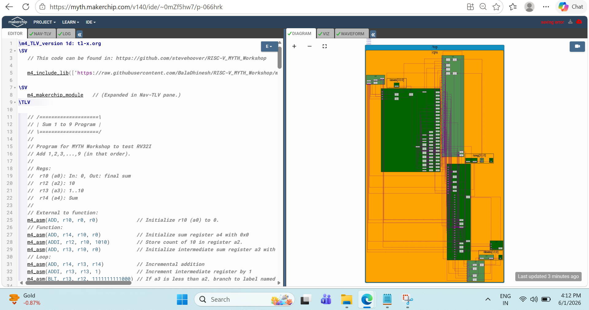
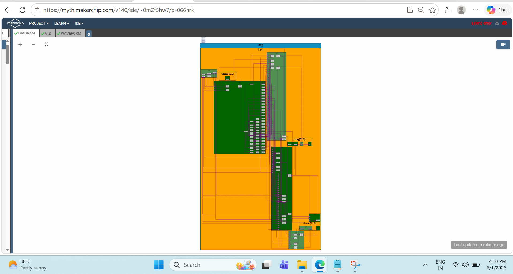
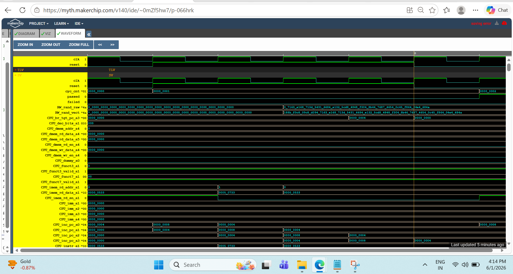
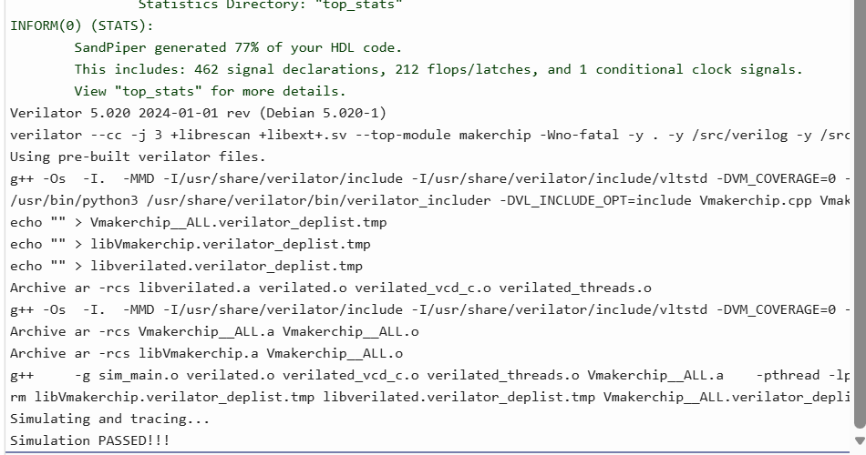

## About the Workshop

The **RISC-V based MYTH (Microprocessor for You in Thirty Hours)** Program is a hands-on learning initiative designed to bridge the gap between software and hardware by guiding participants through the complete journey of processor design.

Unlike traditional courses that focus only on theory, this workshop follows a practical learning approach where participants gradually progress from understanding the fundamentals of the RISC-V Instruction Set Architecture (ISA) to designing and verifying a functional pipelined RISC-V CPU.

The journey begins with RISC-V software development, assembly programming, GNU toolchain usage, and ABI concepts. It then transitions into digital design fundamentals using TL-Verilog and Makerchip, covering combinational logic, sequential logic, pipelining, and validity concepts.

As the workshop progresses, these foundational concepts are applied to build a RISC-V processor step by step. Participants implement instruction fetch, decode, execute, register file operations, ALU functionality, control logic, branching mechanisms, hazard handling, and memory operations before finally completing and verifying a pipelined RISC-V CPU.

The workshop provided me with valuable exposure to processor architecture, RTL design methodologies, pipeline implementation, verification workflows, and systematic debugging techniques, helping me strengthen my understanding of modern digital design and computer architecture.

---

## What You'll Find in This Repository

This repository is more than a collection of workshop notes. It serves as a structured record of my learning journey throughout the RISC-V based MYTH (Microprocessor for You in Thirty Hours) Program, documenting both the concepts I learned and the practical implementations I completed.

### Day-wise Documentation

A structured breakdown of each day of the workshop, including concepts, observations, lab exercises, and key takeaways.

### Hands-on Implementations

Step-by-step implementation of various concepts ranging from RISC-V fundamentals and ABI to digital logic design and processor development using TL-Verilog.

### Personal Notes and Learnings

My understanding of the topics covered during the workshop, documented in my own words to reinforce learning and serve as a future reference.

### CPU Design Evolution

The progression from understanding processor fundamentals to implementing and verifying a pipelined RISC-V CPU.

### Verification and Waveform Analysis

Simulation outputs, waveform captures, and verification results used to validate processor functionality.

### Debugging Journey

Challenges encountered during implementation, debugging approaches, observations, and lessons learned while resolving design and simulation issues.

### Final CPU Project Showcase

The completed pipelined RISC-V CPU, including architecture diagrams, waveform verification, simulation results, and Makerchip sandbox reference.

### References and Resources

Helpful resources, documentation, and references that supported my learning throughout the workshop.

This repository reflects not only the final outcomes of the workshop but also the thought process, experimentation, and continuous learning involved in building a processor from the ground up.

---

## Learning Roadmap

The workshop follows a progressive learning approach, starting from software execution and gradually advancing toward the design and verification of a complete pipelined RISC-V processor.

| Day | Topics Covered | Documentation |
|------|----------------|---------------|
| Day 01 | RISC-V ISA, GNU Toolchain, Integer Number Representation | [Day 01 Documentation](./day01/README.md) |
| Day 02 | ABI and Basic Verification Flow | [Day 02 Documentation](./day02/README.md) |
| Day 03 | Digital Logic Design using TL-Verilog and Makerchip | [Day 03 Documentation](./day03/README.md) |
| Day 04 | RISC-V CPU Microarchitecture, Fetch, Decode and Execute | [Day 04 Documentation](./day04/README.md) |
| Day 05 | Pipelining, Hazard Handling and Complete CPU Design | [Day 05 Documentation](./day05/README.md) |

---

### Learning Progression

| Stage | Learning Focus |
|---------|----------------|
| Day 01 | Understanding Software Execution |
| Day 02 | Verification & Debugging |
| Day 03 | Digital Logic Design |
| Day 04 | Building a RISC-V Processor |
| Day 05 | Completing & Verifying a Pipelined CPU |

---

## My Learning Journey

Before joining this workshop, I had a basic understanding of digital electronics, Verilog, and computer architecture concepts from my academic coursework. However, I had never explored processor design in a structured and practical manner.

The RISC-V based MYTH Program provided an opportunity to understand how software and hardware interact within a processor. The journey began with learning the fundamentals of the RISC-V Instruction Set Architecture (ISA), assembly programming, GNU toolchain usage, and Application Binary Interface (ABI) concepts.

As the workshop progressed, I was introduced to TL-Verilog and Makerchip, where I learned to design and simulate digital logic using a timing-abstract methodology. Concepts such as combinational logic, sequential logic, pipelining, validity, and hierarchy helped me develop a stronger understanding of digital design principles.

The most exciting phase of the workshop was building a RISC-V CPU step by step. Starting from instruction fetch and decode, I gradually implemented register file operations, ALU functionality, control logic, branching mechanisms, pipeline stages, and memory operations.

Alongside implementation, the workshop also strengthened my debugging and verification skills. Analyzing simulation results, interpreting waveforms, tracing signals, and resolving implementation issues taught me the importance of systematic problem-solving in digital design.

By the end of the program, I had successfully designed, verified, and documented a pipelined RISC-V CPU while gaining valuable insights into processor architecture, RTL design methodologies, verification workflows, and engineering documentation practices.

---

## Final CPU Project Showcase

The final outcome of this workshop was the successful implementation and verification of a pipelined RISC-V processor using TL-Verilog and Makerchip.

This processor integrates:

- Instruction Fetch
- Instruction Decode
- Register File
- Arithmetic Logic Unit (ALU)
- Control Logic
- Branch Logic
- Pipeline Stages
- Hazard Handling
- Load/Store Operations
- Complete Verification Flow

---

### Final RISC-V Core

---

### Architecture Verification

---

### Waveform Verification

---

### Simulation Pass Confirmation

---

### Final Outcome

Successfully designed, implemented, debugged, verified, and documented a complete pipelined RISC-V CPU.

The processor supports:

- Arithmetic Instructions
- Logical Instructions
- Branch Instructions
- Pipeline Execution
- Hazard Handling
- Register Operations
- Memory Access Operations
- Complete Simulation Verification

This project represents the culmination of the entire workshop journey and demonstrates the transition from understanding software execution to implementing a verified processor architecture.

---

## Debugging Diary

One of the most valuable aspects of this workshop was the opportunity to debug and verify the processor during development.

Some of the major challenges encountered during implementation included:

- Pipeline stage dependency issues
- Control flow and branch-related behavior
- Verification of valid signal propagation
- Load and store operation debugging
- Simulation timeout and maximum cycle issues
- Waveform analysis and signal tracing

To investigate these issues, I relied on simulation logs, waveform inspection, register-level verification, and step-by-step analysis of processor behavior.

This debugging process significantly improved my understanding of processor architecture, pipeline execution, verification methodology, and systematic problem-solving techniques used in digital design workflows.

---

## Skills Developed Through This Workshop

### Processor Architecture

- RISC-V ISA
- CPU Datapath Design
- Instruction Execution Flow
- Fetch / Decode / Execute Stages

### Digital Design

- Combinational Logic
- Sequential Logic
- Pipelining
- Timing Analysis
- Validity Concepts

### RTL Design

- TL-Verilog
- Makerchip Platform
- Modular Hardware Design
- Register Transfer Level Design

### Verification

- Simulation Analysis
- Waveform Debugging
- Signal Tracing
- Functional Verification

### Engineering Practices

- Documentation
- Debugging Methodology
- System-Level Thinking
- Problem Solving

---

## Key Learnings & Project Summary

This workshop helped me bridge the gap between software concepts and hardware implementation by providing hands-on experience in processor design and verification.

Throughout the program, I gained practical exposure to:

- RISC-V ISA Fundamentals
- GNU Toolchain and ABI Concepts
- TL-Verilog and Makerchip
- Digital Logic Design
- Processor Microarchitecture
- Pipeline Design and Hazard Handling
- Verification and Waveform Analysis

As the final outcome of this journey, I successfully designed, verified, and documented a pipelined RISC-V CPU using TL-Verilog and Makerchip.

Beyond the technical concepts, this experience strengthened my problem-solving, debugging, and documentation skills while providing a deeper understanding of modern processor design workflows.

## Acknowledgements

I would like to express my sincere gratitude to everyone who contributed to making this learning journey possible.

Special thanks to:

* Kunal Ghosh for his guidance, mentorship, and efforts in making processor design concepts accessible to students.
* Steve Hoover for developing TL-Verilog and Makerchip, which provided an intuitive and practical platform for learning digital design and processor development.
* Shrihari and the VSD Team for organizing and supporting the RISC-V based MYTH Program.
* Redwood EDA and Makerchip for providing the tools and resources that enabled hands-on learning throughout the workshop.

I am grateful for the opportunity to learn, build, verify, and document a complete RISC-V CPU design through this program.

---

## About Me

Hello! I'm **Vijay Kumar**, an Electronics and Communication Engineering (ECE) student with a strong interest in VLSI Design, RTL Design, Processor Architecture, and Digital System Design.

I enjoy exploring how hardware systems are designed, implemented, and verified, and I actively document my learning journey through hands-on projects and technical write-ups. My goal is to continuously strengthen my understanding of semiconductor technologies and contribute to the field of chip design and computer architecture.

### Areas of Interest

* VLSI Design
* RTL Design
* Digital Design
* Processor Architecture
* RISC-V
* Computer Architecture
* Verification Methodologies

### Connect With Me

LinkedIn: [https://www.linkedin.com/in/vijay-kumar-b9a9bb271]

GitHub: [https://github.com/vijay080604]
